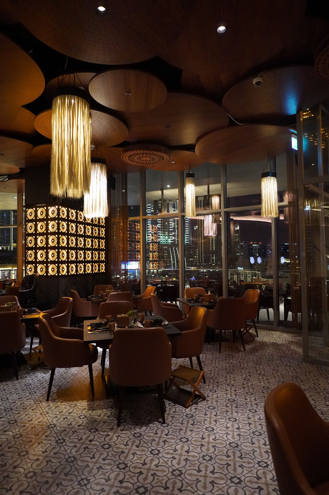
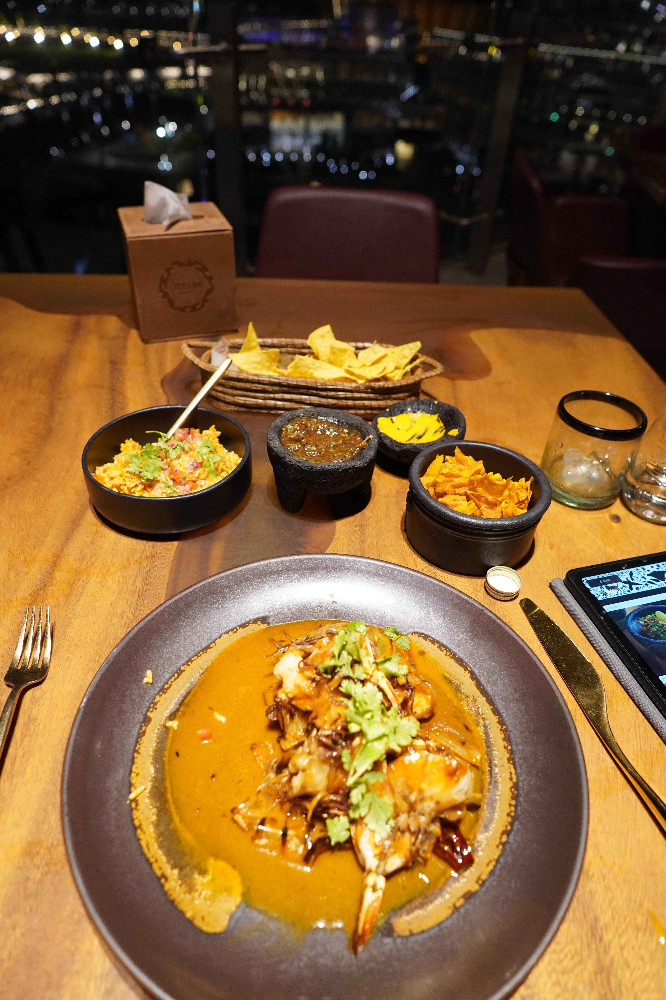
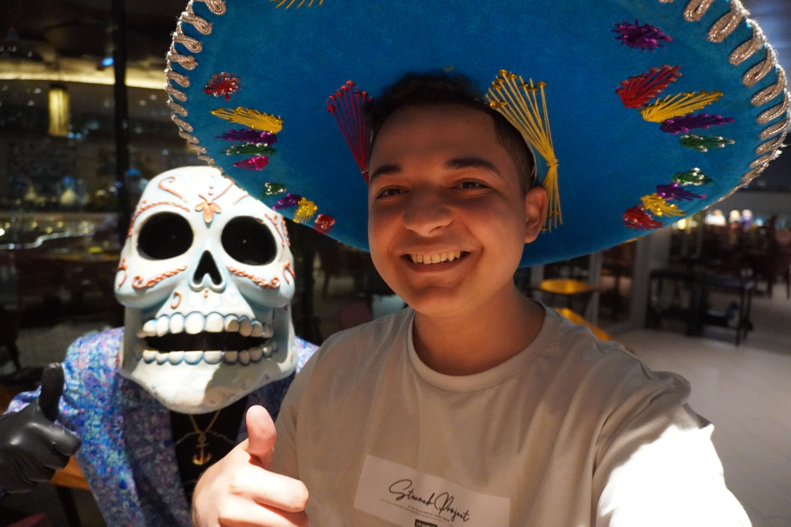
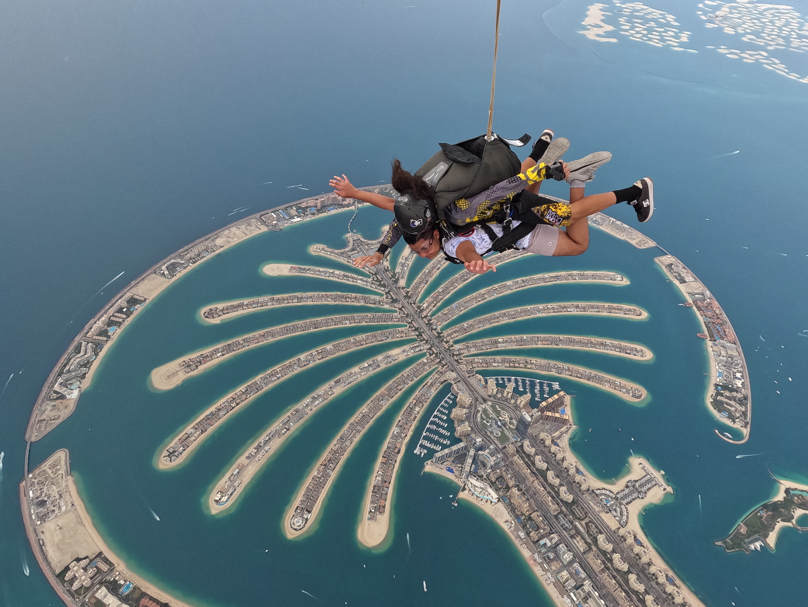
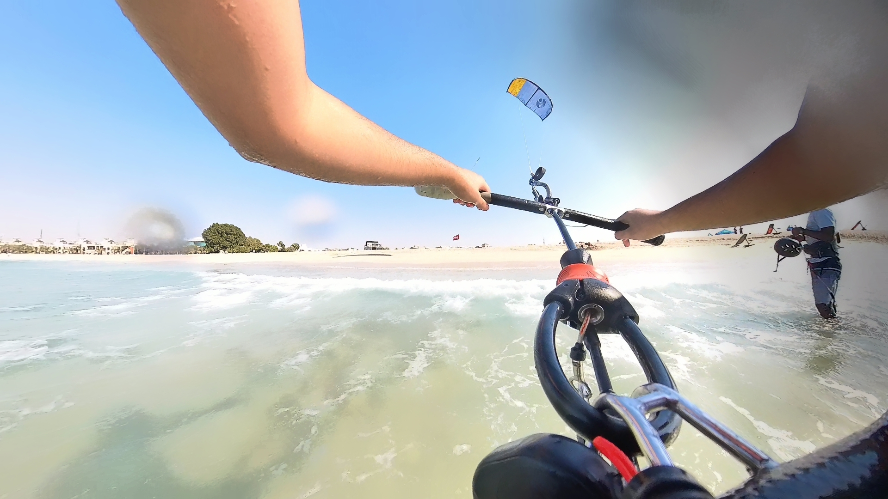

## My Personal Journey to FIRE

I'm Yassin Eldeeb, raised in Tanta, Egypt. I have been raised in a house with both a working father and mother with a total household income of $300-500 per month, which barely affords basic groceries for food -- forget about nutella, peanut butter, and cereals, those were extreme luxuries, and meat (including chicken and beef) were only available once in each week and labelled as "🌟 the week's meal 🌟". eating out was impossible, I can only remember eating out maybe 5-10 times while on yearly trips to Alexandria, but still it was very cheap food when we eat outside like "Liver" and "Koshary".

Rent was too high, after 6-7yrs of savings, we picked a 100m2 plot of land in the middle of nowhere. I think around 2009 or something, and we began construction of a family house where we get the middle floor apartment, and both of my paternal uncles in the first and third floor, that way the cost of the land and construction is shared, overall I think it came to around 4-5K usd to pay for the shared cost of land, and the construction of the apartment. I remember for the first 7mo, watching "Sponge Bob" on my antena square TV, every day after school, while sitting on the cold ceramic floor, because we didn't have furniture initially, we got a few nice couches, chairs and a table for food throughout the first year of moving.

My weekly allowance was $2-5, and was enough to go out once every weekend with elemantry or middle school friends where we share the cost of a 1h playstation or football stadium or most of the time, I'd save all of that money to buy a 2-5gb mobile internet package and stay at home explore and wonder how magical is this thing called "the internet", my mind was always blown away by this magical gateway to infinite amount of information and fun. We didn't have DSL home internet, because back then only rich cities had access to it, and not rural areas.

4yrs later, and that plot of land in the middle of nowhere suddenly started to gather more attention from other people building homes, and it became a decent size neighborhood, we bought our first car, it was a used Lada Riva, life was good, I mean, it has always been good, with very limited access to internet, there's really nothing to have a benchmark of what life could have been. but suddenly, at the age of 11, my father was very close to a heart attack, and had only a week notice that he MUST get a heart surgery or else he is gonna die. Public hospitals unfortunately were known to have not very high success rates, and top private hospitals were gonna be absolutely insanely ridiculously expensive for a heart surgery operation, I don't know/remember the exact number, but it doesn't matter, you know how expensive this is without health insurance.

Fortunately, my father's boss covered 40% of it, both of my parents drained all of their savings to zero, sold our car, and we borrowed the rest from all of our family relatives, coworkers, neighbors, every single person we knew about. and my father decided to go to the top private hospital, my father traveled to Cairo and spent a few weeks for the operation with my mother's alongside for support, and as three children, we were each sent to one of our maternal uncle during this process, I'm the older brother by 3 and 7 years difference respectively with my siblings, I was the only person grown enough to realize how bad our situation is gonna be if my father didn't come home. but finally, after a few weeks, fortunately, he came back with a successful operation.

but...with a shit ton of money in debt to a shit ton of people, around this time, he was almost 50 years old, with plans to retire at 60, which obviously became an impossible goal, bc instead of saving for his next years, now future only looked like it was gonna be spent paying back his debt.

with internet being more accessible, and the infrastructure in our area advancing with not only basic internet copper coils but fiber internet, I started spending almost all day on the internet, and slowly discovering and understanding the reality of our financial position. I started to develop some level of depression, and sadness, alongside impossibly out of reach goals and vibrant dreams of being "rich", and living life how internet influencers are living like.

at the age of 14, I had enough exposure to internet, to know how cool "websites" were. I was also very obsessed with tech channels, so I decided to start writing a blog reviewing mobile phones I never had and giving my personal opinion over the latest mobile phones. I found and used this thing called "SimDif" which was an app on mobile to create websites with no code, just using widgets.

I also plugged in Google adsense on the website, but it never got any money, yet I have always bragged with my friends about how cool I am having "yassin.simdif.com" website on google, and lied about getting a lot of money from the ads there.

one day, during the same school year, we got introduced at school on "HTML" in the computer class, and so everyone in the class, was like: "Teacher, yassin is a genius, he coded his own website, he has a blog post that gets a lot of money!!" the teacher then gave me a USB drive, and asked me "to bring the code files" to class next week bc he was impressed.

I knew I cheated with the no-code tools to build my site, but I had to cover it....on my mobile, I started copying all of the generated source files, and learning from W3Schools more on HTML and CSS for a week, so I can understand how the code should look like and know how to clean it up and refactor it so it doesn't look like it was generated.

next week, I showed the files to my teacher on a one on one session privately, and he was very impressed. the code was messy, but it looked like a human wrote it, surprisng to him, the site was so pretty, and getting a site pretty around 2016 on internet explorer 11 was really difficult, any boomers remember "float" and "cells" in CSS before flexbox was popular?

my father had a conversation from my computer teacher, where he said: "Yassin has a lot of potential, he's obsessed with websites, and you should really send him to a coding bootcamp"

my father gave me his old toshiba satelite laptop (if anyone remember those early 2000s ones), it was an intel i3 2nd gen, and 2gb of ram. and sent me to a web development bootcamp for 5 months where I learned IDEs, HTML, CSS, Javascript, JQuery, Version Control, Git, Github, domains and Deploying.

After graduating with a course completion certificate. I still was very hungry to learn more, I started building a lot of projects, took a React course online, learned all about npm, state management, redux, hooks, etc...

I got in contact on Facebook with someone who works at a consulting firm in my city, they were mobile app developers, and they needed advertising websites for their clients’ apps. I chatted and requested to do that job, while showing off what I can do. I got accepted to work with them, I got paid per website. I did one which was quite a popular app (for a short period of time) for selling used stuff in Egypt, and the landing page was phenomenal.

I then worked with a local Nestle Egypt branch, developing geographic tools to visualize customers sales across all of Egypt, till today, that’s still a very useful app that’s used weekly.During my time on the Nestle project, I learned a lot of python because it was the perfect use to cleanup their excel data sheets and extract a useful data format to use within the app, I also had to work with Node for backend.

When my work ended, I noticed that while I’m working on a project, I learn very little compared to doing my own thing independently, I decided to put hold on work, and invest more time into learning, but now I decided to do everything in public from my learnings to projects on GitHub and Twitter. I spent about 18 months in the state of an “Independent Open Source developer”, learned soooo many things, from getting very deep into backend, with Node, databases, C++, devops, typescript, graphql, K8s, Rust, react native, etc.. it was a very very productive period of my life.

Then, I got very close to my senior high school year, and my parents were like: “Yassin, I know you love this, and you’re really good at this, but you need to prove to us that you can make a full-time high paying job out of it, or you need to focus on school and get a degree. I don't want you to end up on the streets, you know you can't make a living in Egypt without a degree”, keep in mind, my father was very supportive of what I’m doing, and knew exactly the value of these skills I’m rapidly developing, so I spent very little time in formal education in school, fortunately (well...not very fortunately), Covid kicked in with a full 2 years of homeschooling and exams were remote, and no required physical attendance, which gave me soooo much time to invest into coding during that 2 years period.

I spent 2 months applying for jobs, until I landed the biggest contract I’ve ever had. It was my first job for a US company, earning in USD. It was a company based in South Carolina, I led the development of Home School teachers' backend, which was an interactive activity builder, now boasting over 50,000 active monthly students.

And, you can only imagine my parents feeling towards an almost 18 year old making six figures a year in USD, not only that, but creating an impact on home schooling in the US. They were infinitely proud, and started feeling financial security and stability. And astonished in unbelief that I’m making in a year, more than what they earned in a lifetime of working with their combined income.

I dropped out of high school as I saw no benifit of contineuing, and I then, transitioned into another consulting role at another company in the US for a year.

But, one very important note is that: I have never enjoyed any of the work I did for both of my 2 US consulting jobs, nor the other 2 jobs I did in Egypt. It brought really good money, but I never truly enjoyed the work I was doing, I didn’t like the whole notion of NDAs, building privately, and not being able to share my achievements publicly.

I also hate being told what to do, even when I strongly disagree or am very impassionate about it. I also never shared any interests within my teammates future career and goals.

Since, I started earning a lot more with, I started to learn a lot more on finance and investing, my goal was like this: “Do whatever to earn as much as possible, invest as much as possible, and have the financial freedom to pursue my good old independent open source workflow/dream.” And I did that.

But suddenly, I get this email from “The Guild” inviting me to join their open source team building the leading graphql tooling, and I was like...”what...hooooly...shit!!! what a life changing event and a weird turn for my ongoing plan to financial independence”, I joined, and found a team who shares a very similar life and career goals, a young and passionate skilled team with very ambitious goals and impact on hundreds of thousands of developers, and a company with very humble and respectful leaders/founders that I never imagined possibly existing, and that was exactly what I wanted with my plan of financial independence. And as you might expect, my transition initially wasn't very smooth, as I had all of this huge thing planned out that I was pursuing for many years since the start of my career.

Now, does that mean putting a hold on financial independence? No. I would never ever want to be in the same position as I were with shitty corporate and management I absolutely hate, and fully disagree with everything on how we operate.

It only means I’m not going crazy as I was with 2-3 concurrent jobs to reach my goal faster. But accepted the process going a little slower than initially planned, so I can have a work-life balance, and actually enjoy a life.

If you’re comfortable where you are now, just know it’s wild out there, always account for a possible layoff or being fired for no reason at any given time, be sure, that there's no emotions with business, and none of that "we're a family" bullshit crap, once your company can't afford you, you're gonna be let go no matter what, after which if you’re not prepared, you’ll have to accept jobs solely to make a living.

As of now, I’m 19 years old, turning 20 very soon, and my family (of 4 members) are retired on my investing portfolio, while leaving the principal grow over time and investing most of my income every single month, I’m expected to have the option to fully retire in any country of my chosen in the world at the age of 24.

Plot twist: I still live with my parents, in the same house I told you about earlier ;)
Never!!! NEVER get dragged into lifestyle inflation!

Here’s my rules:
- if I want to buy something, wait for a week and revisit that thing I want to buy, unnecessary interests of wants tend to be irrational and temporary.
- a lifestyle that costs more than 10% of my monthly income is a lifestyle I simply can’t afford.
- health is your most valuable asset in your life, take good care of your body. this can completely flip your life upside down.

That's it. Thanks for reading 🤗
Also, don't feel sympathy for me, I love how I chose my life and how everything turned out and could have never wished for a better career path.

I'm not gonna lie, when i just turned 18yo, I got into thinking about buying a big house in new cairo’s center, costing around $600k. we spent about a month checking out this place, getting all wrapped up in the decision-making. I was on the verge of shifting from a 2009 home in a once remote area to one of egypt’s most lavish neighborhoods.

but then, reality check hit me – i was about to break my very own rule: “never inflate your lifestyle too quick”. this wasn’t just a new house; it was a leap into an entirely different world of big-time spenders and extravagant living.

a month later, i got completely out of it, just before closing out the deal. got myself back on track, focusing on being smart with money, aiming straight for financial independence. remember, getting there is a process. at first, it seems like a mountain too high to climb. but once you get going, gain some momentum, it becomes clear – it’s not as unreachable as it felt. it's actually pretty doable, just takes consistent effort and sticking to your guns.

---------

now to an interesting question some of you may be having..."okay, you're talking about frugality, living below your means, and all of that good stuff, but have you ever experienced luxury living?" The answer is: Yes.

I’m not gonna lie, I've always had this FOMO (fear of missing out), and was always curious what was on the complete opposite side of living frugally looks like. so I decided to take the shot. I went on a trip to somewhere very expensive....and what better place than Dubai have I found to burn as much money as possible in the shortest period of time!!

I went on a trip for a week on a $1000 daily budget. And wow! was it fun? Yes, very fun, to be specific it was the costly once in a lifetime physical experiences I have had, and not the luxerious living. I stayed at the best most expensive hotels, the tallest hotel in the world, I ate out every single day, and every single meal. I went to the most expensive 5-stars restaurants costing $200-500 for a single person's 5-10 course meal, been to the very top of burj khalifa, took premium taxis everywhere I went. Went sky-diving, went deep diving in the deepest pool in the world, took a kite surfing course, had the best spa/massage/sauna sessions every day. Went luxury shopping in the biggest mall in the world "The Dubai Mall". so was it fun? yeah. but was it worth 20-30x my daily expenses? Absolutely not!!

So, lessons learned. Luxury living looks good on camera, but in reality is not really that fun, and is really not worth the cost. If you want to experience the true fun I had in Dubai on a luxerious lifestyle, just go on a 1 day transit skydiving or deep diving for $800. That's truly the once in a lifetime experiences you'll never forget and you'll forever remember. That's about 90% of the fun I've had, everything else, I got bored of it after the first or second day.

Here are some pictures from that trip I mentioned. Remember, things always seem way better and cooler on camera, compared to how they are in reality.

