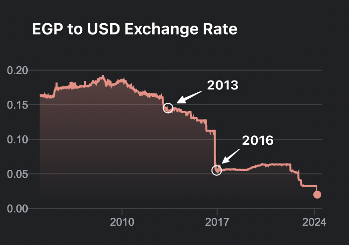
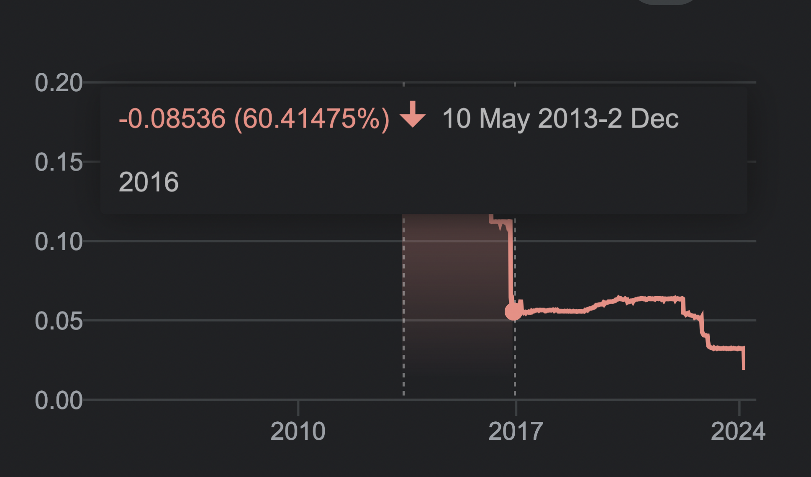
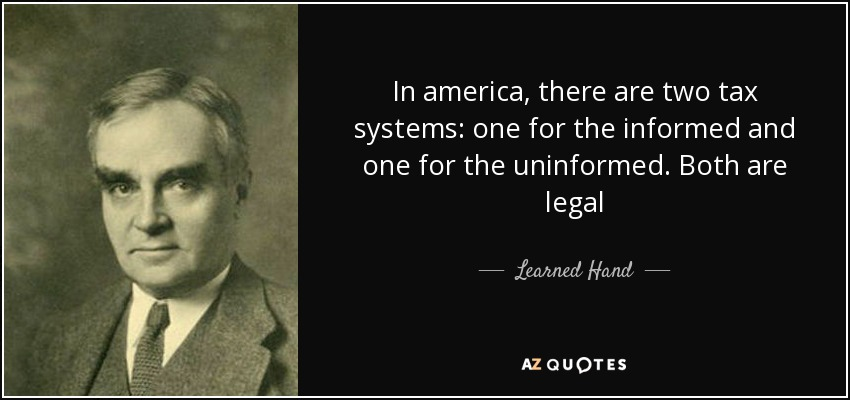
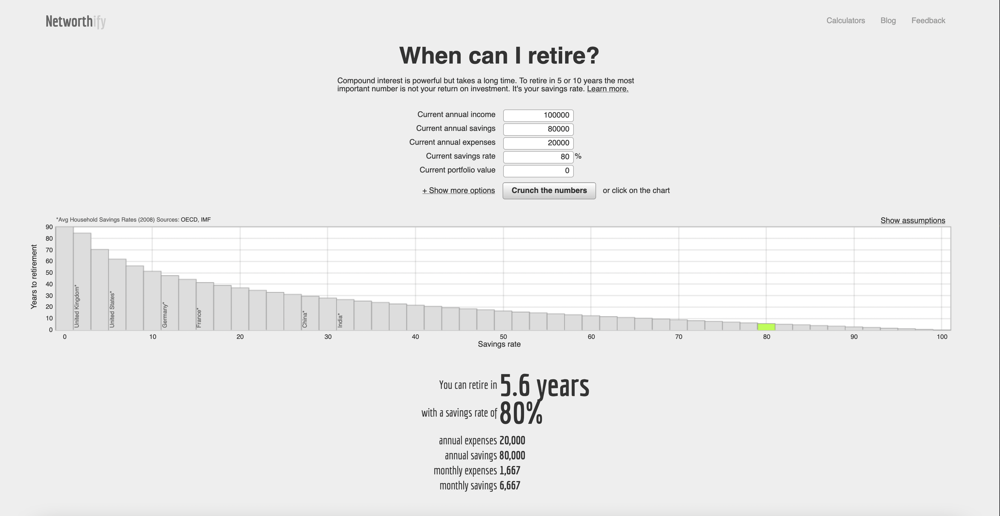
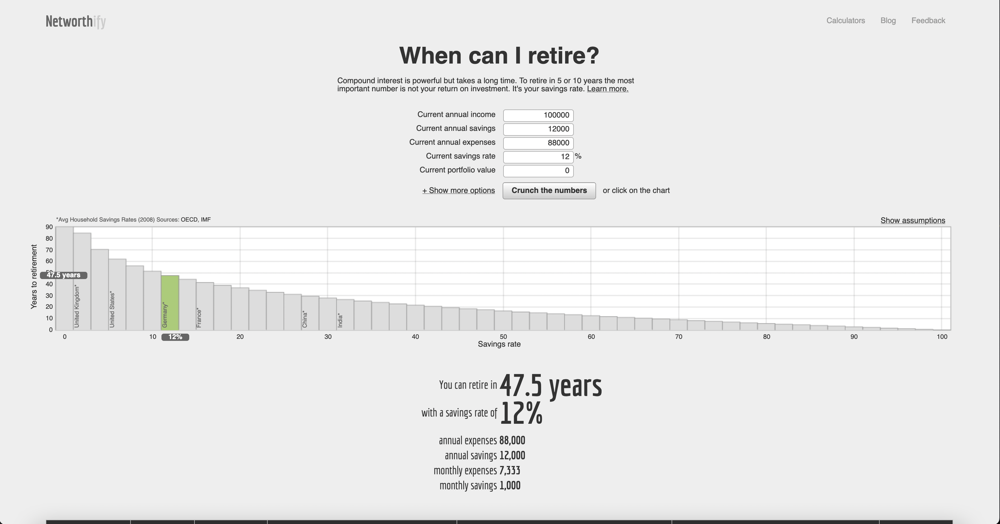
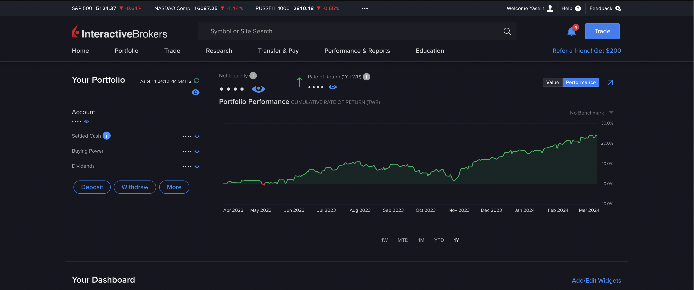
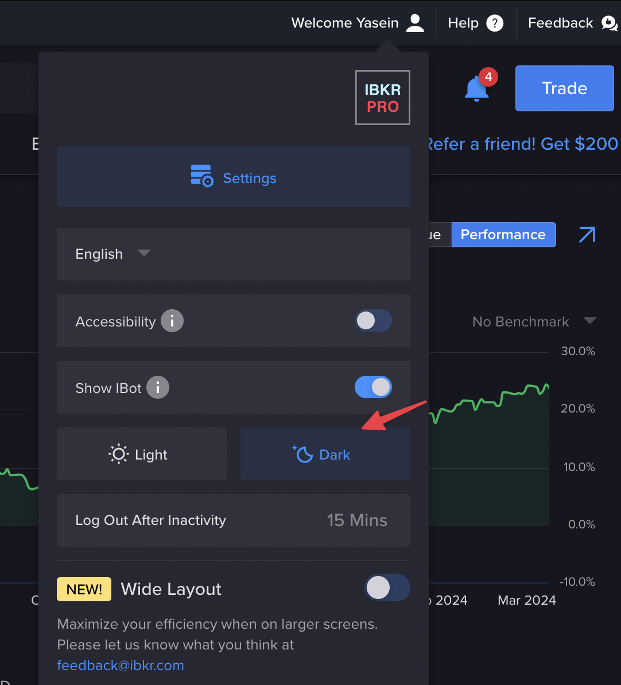

# تمكين مواردك المالية: دليل شامل للمال والضرائب والحياة الذكية

## رخصة

تم ترخيص هذا المشروع بموجب الترخيص الدولي Creative Commons Attribution-ShareAlike 4.0 - راجع ملف [LICENSE.md](LICENSE.md) للحصول على التفاصيل.
باختصار، يمكنك أن تفعل ما تريد به، تمامًا مثل ترخيص معهد ماساتشوستس للتكنولوجيا (MIT)، عليك فقط أن تمنحني نقاطًا أينما تستخدمه.

> ## ⚠️ إخلاء المسؤولية:
>
> يرجى ملاحظة أن هذا الدليل مخصص للأغراض المعلوماتية والتعليمية فقط ولا ينبغي تفسيره على أنه نصيحة مالية احترافية. يعكس المحتوى المقدم الآراء والتجارب الشخصية وقد لا ينطبق على جميع الظروف الفردية. ينبغي اتخاذ القرارات المالية بناءً على العناية الواجبة الخاصة بك، وعند الاقتضاء، بتوجيه من أحد المتخصصين المؤهلين.
>
> المعلومات المقدمة في هذا الدليل لا تشكل نصيحة قانونية أو ضريبية أو استثمارية أو أي نصيحة مهنية أخرى. المؤلف والمساهمون ليسوا مسؤولين عن أي خسارة مالية أو أضرار أخرى قد تنجم عن تطبيق الأفكار والاستراتيجيات التي تمت مناقشتها. تذكر أن الاستثمار في سوق الأوراق المالية والمشاريع المالية الأخرى ينطوي على مخاطر، والأداء السابق لا يشير إلى النتائج المستقبلية.
>
> ضع في اعتبارك دائمًا وضعك المالي وقدرتك على تحمل المخاطر قبل اتخاذ قرارات الاستثمار واطلب المشورة من المتخصصين الماليين والضريبيين والقانونيين المناسبين لظروفك الفردية.

## جدول المحتويات

0. [لماذا أصبح هذا الدليل مهمًا الآن أكثر من أي وقت مضى](#preface-why-this-guide-mattres-now-more-than-ever-ever)

1. [المقدمة](#1-المقدمة)
    - رحلتي المالية الخاصة
    - قوة المعلومات وإمكانية الوصول إليها في هذا العصر الرقمي
    - قوة المال وأهمية الشخصية

2. [واقع التعليم والنظام المالي](#2-واقع-التعليم-والنظام-المالي)
    - الأمية المالية لدى معظم الناس
    - المفهوم الخاطئ للثروة

3. [الضرائب: الفهم والتحسين](#3-الضرائب)
    - ضرورة التخطيط الضريبي الذكي
    - الأعمال الخيرية مقابل الضرائب الحكومية
    - دراسة حالة: عدم كفاءة الأموال التي تديرها الحكومة

4. [الاستراتيجيات القانونية لتوفير الضرائب](#4-قانونيًا-الادخار-على-الضرائب-هيك-نعم-لكن-كيف)
    - تعرف على قانون الضرائب الخاص بك
    - الشركات الأجنبية في المناطق الحرة
    - استراتيجية "مقيم اللامكان".
    - مزايا الإقامة المزدوجة
    - انخفاض قيمة العقارات
    -الامتثال والاعتبارات القانونية

5. [الاقتصاد: العيش بأقل من إمكانياتك](#5-الاقتصاد-العيش بأقل من إمكانياتك)
    - فلسفة التوفير
    - نصائح عملية للأفراد والعائلات
    - تأثير أسلوب الحياة المقتصد
    - وجهات نظر عالمية بشأن الادخار: نظرة على الصين
    - الصحة والاقتصاد: مزيج ثري

6. [الاستقلال المالي: الادخار والاستثمار](#6-الاستقلال المالي-الادخار والاستثمار)
    - فهم الاستقلال المالي
    - بناء صندوق الاستقلال
    - استراتيجيات الاستثمار وتحمل المخاطر
    - أساسيات سوق الأوراق المالية: الأسهم وصناديق الاستثمار المتداولة وصناديق المؤشرات
    - استراتيجيات الاستثمار العقاري
    - النمو مقابل توزيعات الأرباح في الاستثمارات
    - إدارة الديون
    - الديون الجيدة مقابل الديون المعدومة
    - كسر فخ الثروة الفسيولوجية: تعريف *"كفى"*

7. [الولايات المتحدة الضرائب على الأسهم لغير المقيمين](#7-ضرائب الأسهم الأمريكية-ما تحتاج إلى معرفته)
    - ضرائب الأرباح الرأسمالية وأرباح الأسهم

8. [تخصيص الأصول الاستثمارية](#8-تخصيص-الاستثمار-الأصول)
    - الموازنة بين المخاطر والمكافآت في المحفظة

9. [تجنب الضريبة العقارية الأمريكية على غير المقيمين](#9-تجنب-الضريبة العقارية الأمريكية)
    - الاستفادة من الشركات الخارجية والممتلكات الأجنبية

10. [ترك الإرث مقابل الموت بالصفر](#10-اترك الإرث أو مت بصفر)
     - الجوانب الفلسفية والعملية لانتقال الثروة عبر الأجيال القادمة.

11. [بدء رحلتك الاستثمارية: دليل عملي للاستثمار في سوق الأوراق المالية](#11-دليل عملي للاستثمار في سوق الأسهم)
     - تعليمات خطوة بخطوة وأفكار أساسية للمستثمرين الجدد الذين يشرعون في رحلتهم في سوق الأوراق المالية.

## المقدمة: لماذا أصبح هذا الدليل مهمًا الآن أكثر من أي وقت مضى

في صناعة التكنولوجيا المتقلبة، حيث أصبح الاستقرار الوظيفي نادرا على نحو متزايد، فإن المعرفة المالية ليست ذات قيمة فحسب - بل إنها ضرورية للبقاء على قيد الحياة. في هذا المشهد المتغير باستمرار، أريدك أن تتبنى عقلية تكون فيها كل يوم مستعدًا لفقد وظيفتك غدًا. مثل هذه العقلية لا تتعلق بالتشاؤم؛ يتعلق الأمر بالاستعداد والقدرة على التكيف والمرونة في مواجهة عدم اليقين.

تم إنشاء هذا الدليل من حاجة ملحة - لتمكينك، خاصة إذا كنت جزءًا من مجتمع التكنولوجيا، من خلال المعرفة والأدوات اللازمة لاتخاذ قرارات مالية مستنيرة. اعتبره دليلك الشخصي للمرونة المالية؛ مورد يمكنك اللجوء إليه عندما تجد نفسك عند مفترق طرق في رحلتك المالية. وهو يلخص الدروس والاستراتيجيات والأفكار التي جمعتها على مدى أربع سنوات، أثناء التنقل في أوقات الرخاء والركود الاقتصادي.

أكثر من مجرد مجموعة من الدروس المالية، هذا الدليل هو وثيقة حية ومتطورة. هو - هي'إنها دعوة للمشاركة ومناقشة وإثراء محتوياته. لن تؤدي أفكارك وأسئلتك وتحدياتك إلى تحسين هذا الدليل فحسب، بل ستعمل أيضًا على تعميق فهمنا الجماعي للإدارة المالية.

إن جوهر هذا الدليل يتجاوز مجرد التراكم المالي؛ يتعلق الأمر بالتحضير لما هو غير متوقع وتحويل التحديات إلى فرص. إن فقدان الوظيفة، على الرغم من صعوبته، يمكن أن يكون أيضًا حافزًا للنمو والبدايات الجديدة. ربما لم تستمتع بدورك السابق، أو كنت تقوم بجمع الأفكار التي كنت ترغب دائمًا في استكشافها ولكن لم يكن لديك الوقت الكافي لمتابعتها. إن الاستعداد المالي يعني أنه يمكنك مواجهة هذه التحولات بثقة، والنظر إليها ليس على أنها انتكاسات ولكن كفرصة مثالية لبدء تجربة تلك الأفكار، وقد تؤدي إلى نجاح كبير.

لذا، سواء كنت تدخل إلى عالم التكنولوجيا، أو تتنقل في تغيير مهني، أو في مكان ما بينهما، فإن هذا الدليل مناسب لك.

## 1 المقدمة

مرحباً، أنا ياسين الديب. لقد مررت عبر السفينة الدوارة المالية وخرجت على الجانب الآخر. بعمر 20 عامًا فقط، وباتباع الإطار أدناه، أقف كشهادة حية على المبادئ الموضحة في هذا الدليل.

مع عدم وجود ديون على الإطلاق ومحفظة استثمارية تدعم بشكل مريح عائلتي المكونة من أربعة أفراد عند التقاعد لمدة 40 عامًا القادمة دون الحاجة إلى المساهمة بأي شيء ويمكنها أيضًا في نفس الوقت تغطية نفقات معيشتي لمدة عقد كامل، فإن هذا النهج في إدارة الأموال يُظهر القوة من الادخار والاستثمار المنضبط، فإن هدفي التالي الآن هو تحقيق مستوى أكثر فخامة من الاستقلال المالي الكامل بحلول سن الرابعة والعشرين.

و. نعم، نحن نعيش في أوقات غريبة، والعمر ليس مؤشرًا للخبرة، وأنا ممتن جدًا لأنني ولدت كجيل Z، حيث أتمتع بعقلية منطقية فضولية، واتصال بالإنترنت، ووقت للاستثمار في التعلم. يمكنك استهلاك عقود من البحث عن الموارد الأكثر قيمة من ألمع الأشخاص حول العالم في غضون أسابيع وأشهر مجانًا. يمكنك حتى تتبع عملية البحث الخاصة بهم وتقريباً تكون حاضراً في اللحظات التاريخية مثل الأزمة المالية لعام 2008، إذا قرأت ما يكفي عنها، فلن تحتاج إلى الدخول في انهيار لتتعلم كيفية التخفيف منه، عندما تعرف ما تتوقعه . قوية جدا، أليس كذلك؟

أعتقد تمامًا أن منحنى التعلم للطفل أو المراهق يشبه تمامًا تدريب LLM (نموذج اللغة الكبيرة).

### قوة المال وأهمية الشخصية

المال هو أحد أشكال القوة، وهو أداة يمكنها التأثير والتغيير وخلق الفرص لنفسك وللآخرين. ومع ذلك، مع القوة العظيمة تأتي مسؤولية كبيرة. المعلومات الواردة في هذا الدليل لديها القدرة على تمكين الأفراد بشكل كبير خلال فترة زمنية قصيرة. أتمنى أن لا يكون من يستهلك هذا إنسانًا فظيعًا. ابق متواضعًا ومدروسًا ولطيفًا. فقط لأنك تشعر بالحرية أو القوة، لا يعني أنك يجب أن تكون وغدًا مع صاحب العمل أو زملائك في العمل.

القادة الأقوياء الذين أكن لهم أقصى احترامي هم أولئك الذين يظلون متواضعين ومتواضعين على الرغم من نجاحهم وقوتهم، فهم يميلون أيضًا إلى أن يكونوا الأكثر نجاحًا. إن مجرد توليك منصبًا في السلطة أو امتلاك الثروة لا يمنحك الحق في عدم احترام الآخرين أو التقليل من قيمتهم، سواء كانوا موظفيك أو أقرانك. إن القيادة الحقيقية تدور حول إلهام الجميع في مجالك والارتقاء بهم، مع إدراك أن كل فرد، بغض النظر عن دوره أو مكانته، يساهم بقيمة ويستحق الاحترام.

### المفهوم الخاطئ للثروة

- **الربح مقابل الادخار مقابل الاستثمار:** إن فهم كيفية كسب المال لا يعني في الأساس فهم كيفية ادخاره أو استثماره. هذه مهارات متميزة مع مجموعات معرفية فريدة. ليس من غير المألوف أن نرى أصحاب الدخل الممتاز هم مدخرون فقراء، أو مدخرون كبار يكافحون من أجل تنمية ثرواتهم من خلال الاستثمار.

- **مثلث الثروة:** تصور الكفاءة المالية على أنها مثلث مكون من ثلاث نقاط: الربح والادخار والاستثمار. يعد الإتقان في اثنين منها أمرًا ضروريًا، لكن التفوق في الثلاثة يؤدي إلى نجاح مالي رائع.

- **إحصاءات مفاجئة:** على الرغم من الدخل المرتفع، يعيش العديد من الأميركيين على راتب مقابل راتب. كشف استطلاع أجراه LendingClub عام 2022 أن 36% من أصحاب الملايين يعيشون من راتب إلى راتب. بالنسبة للأفراد الذين يكسبون أكثر من 100000 دولار، يواجه واحد من كل ثلاثة هذه المشكلة، ويزداد العدد إلى أكثر من واحد من كل أربعة لأولئك الذين يكسبون 200000 دولار أو أكثر.

## 2. واقع التعليم والنظام المالي

"يفيد نظام التعليم الرسمي "النظام"** أكثر من الفرد. إذا كان الاقتصاد يزدهر بسبب إنفاق المستهلكين بشكل مفرط على "الرغبات"، فلن يكون هناك حافز كبير لتثقيف الناس حول إدارة ثرواتهم وتنميتها. وبدلاً من ذلك، هناك اتجاه لدفع النزعة الاستهلاكية، ويؤدي إلى الأمية المالية.

في المناطق المختلفة، تختلف المواقف تجاه التمويل والاستثمار بشكل كبير. على سبيل المثال، في أوروبا، هناك اعتماد على الضمان الاجتماعي؛ يتم دفع ضرائب مرتفعة، لكن في المقابل تقوم الدولة بمعالجة البطالة، على سبيل المثالالتعليم، والتقاعد. إنه نظام يناسب الكثيرين، ويوفر الأمان والبساطة، ولكن من وجهة نظري، فهو يفتقر إلى الكفاءة والتمكين الشخصي.

ولنقارن هذا بالنهج الذي تتبعه الولايات المتحدة، والذي يشجع الاستثمارات الفردية من خلال حسابات 401K، وRoth IRA، وHSA. وعندما تكون أنظمة الضمان الاجتماعي سيئة، فإن ذلك يؤدي إلى شعور بالخوف الشخصي والمسؤولية في الأمور المالية.

لقد أمضيت أكثر من 10000 ساعة في السنوات الأربع الماضية (وهو رقم تقريبي يشير إلى تطوير خبرة حقيقية في أي مهارة معينة) في تعلم التمويل الشخصي والاستثمار، مدفوعًا بهذه الحاجة إلى الأمن المالي الشخصي، وأريد مشاركة كل ما أقوم به لقد تعلمت وجربت في هذا الدليل مفتوح المصدر.

## 3. الضرائب

حسنًا، لنكن واقعيين فيما يتعلق بالضرائب. لقد قيل لنا جميعًا أن أموالنا التي حصلنا عليها بشق الأنفس تذهب لإصلاح الطرق ومساعدة المشردين وكل تلك الأشياء الجيدة. ولكن هيا، قم بالتجول في المدن الكبرى - التشرد، والطرق المكسورة، وحتى مدمني المخدرات الذين يعانون في الشوارع. أين تذهب كل أموال الضرائب هذه حقًا؟ لقد حان الوقت لنواجه الأمر: النظام فاسد وفاسد.

إليكم الاتفاق: أنا لا أقول لا تدفعوا الضرائب التي تتحملون مسؤوليتها، وهذا ما يسمى "التهرب الضريبي" وهو أمر غير قانوني على الإطلاق.
لكن فيما يتعلق بالذكاء فيما يتعلق بالضرائب، إذا كنت تجني أموالاً جيدة، فمن الغباء ألا تبحث عن طرق قانونية لتوفير الضرائب، الأمر لا يتعلق بغش النظام؛ ولكن عليك أن تتعامل بذكاء مع أموالك التي كسبتها بشق الأنفس.

> أي شخص يكسب المال ويدفع الضرائب ليس له الحق فحسب، بل واجب توفير الضرائب.
>
> القاضي المتعلم في قضية الضرائب هيلفرينج ضد غريغوري

أنا لست ضد التخلي، في الواقع أنا أشجع ذلك بشدة. أريدك أن ترى وتختبر الفرق بنفسك بين التنازل عن 40% من دخلك للحكومة والتبرع بـ 10% من دخلك للأشخاص المحتاجين في منطقتك. أنا أتحدث عن التبرعات المباشرة، وليس الجمعيات الخيرية الضخمة، وأنا شخصيًا لا أعتقد أنهم يقدمون المساعدة بشكل كافٍ، نظرًا لوجود تكاليف تشغيلية كبيرة جدًا عادةً.

### عمل خيري

لنفترض أنك من بين 1-5% من أصحاب الدخل الأعلى في بلدك، وهم الأشخاص الذين يجب أن يخفضوا فواتيرهم الضريبية، لنفترض أنك تكسب 100 ألف دولار سنويًا، أريدك أن ترى مقدار تأثير 10 آلاف دولار على حيك وافتح عينيك على الاستخدام غير الفعال لأموال الضرائب الخاصة بك؛

- **إطعام العائلات المتعثرة**: بمبلغ 10 آلاف دولار، يمكنك توفير الطعام لـ 33 عائلة متعثرة لمدة شهر كامل.
- **جراحة الساد**: تختلف تكلفة جراحة الساد، ولكن لنفترض أنها تبلغ حوالي 2500 دولار للعين الواحدة بدون تأمين صحي. يمكن لمبلغ 10 آلاف دولار الخاص بك تمويل العمليات الجراحية لشخصين بالكامل، واستعادة بصرهم بالكامل. ولا يتعلق الأمر بالصحة فقط؛ يتعلق الأمر بإعادة شخص ما إلى استقلاله ونوعية حياته.
- **المساعدة في الإيجار**: بالنظر إلى متوسط إيجار قدره 1000 دولار لشقة متواضعة، يمكن أن تمنع مساهمتك إخلاء حوالي 10 عائلات أو أفراد من خلال تغطية الإيجار المستحق عليهم بشكل عاجل لمدة شهر.
- **الدعم التعليمي**: يمكن بمبلغ 10 آلاف دولار أمريكي تجهيز مدرسة محلية تعاني من نقص التمويل بأجهزة كمبيوتر جديدة أو مواد تعليمية. على سبيل المثال، إذا كان جهاز الكمبيوتر المحمول يكلف حوالي 500 دولار، فيمكنك توفير 20 جهاز كمبيوتر محمول، مما يعزز بشكل كبير موارد التعلم للطلاب.
- **فحوصات الرعاية الصحية**: إذا كانت تكلفة فحص الصحة العامة حوالي 100 دولار أمريكي للشخص الواحد، فإن مبلغ 10 آلاف دولار أمريكي الخاص بك يمكن أن يوفر لـ 100 شخص فحوصات صحية أساسية، مما قد يؤدي إلى تحديد المشكلات الصحية مبكرًا وتوفير راحة البال.

وهذا تأثير هائل من فرد واحد فقط، يمكنك رؤيته بأم عينيك!!

كشخص يتبع الإسلام إلى حد ما، هناك عدد من الأحداث السنوية التي أشارك فيها بنشاط في العديد من الأعمال الخيرية التي تحدثت عنها. لكنك بالتأكيد لا تحتاج إلى أن تكون متدينًا لتمتلك حس الإنسانية والرحمة.

### دراسة حالة: عدم كفاءة الأموال التي تديرها الحكومة

ومن الأمثلة المثيرة للقلق على سوء الإدارة المالية الحكومية حالة صناديق التأمين الاجتماعي في مصر. وفي الفترة بين عامي 2005 و2013، عانت هذه الصناديق من خسارة صادمة بلغت 60% في سوق الأسهم. 60% من أموال الضرائب ودخل المتقاعدين تبخرت للتو!!! وكشف الدكتور أحمد البرعي، وزير التضامن الاجتماعي آنذاك، عن وجود **جزء غير محدد** من هذه الأموال المستثمرة في الأسهم والتي بلغت قيمتها الإجمالية 397.7 مليار جنيه مصري، أي حوالي 55.678 مليار جنيه مصري. دولار أمريكي. ولوضع ذلك في الاعتبار، بلغ الناتج المحلي الإجمالي لمصر 329.4 مليار دولار أمريكي في عام 2015. هل ترى مدى ضخامة هذا الفشل؟ لا أحد يعرف كم كان هذا الجزء كبيرًا أو صغيرًا.

أنا لست خبيرا ماليا ولا أفهم تماما كيف تعمل حكومتي أو حكومتك، وكيف يمكن أن تخفف من مثل هذا الفشل الفادح. ولكن دعونا نلقي نظرة على هذه الرسوم البيانية المثيرة للاهتمام:

هممم...أغلق أليس كذلك؟ وهي أيضًا 60%.

عليك أن تفهم أن الحكومات ليست هذه الكيانات المتفوقة المعصومة من الخطأ. تتكون الحكومة من أشخاص، لديهم السلطة على مجموعة من الأشخاص الآخرين، الذين يملكون السلطةلديك سلطة على مجموعة من الأشخاص الآخرين. ومع كل الأخطاء البشرية والتحيزات التي تأتي معها. الأشخاص الذين لديهم سلطة على الآخرين، وما إلى ذلك. إنها مثل سلسلة من القرارات البشرية، وليست جميعها صحيحة.

[المصدر](https://www.youm7.com/story/2013/12/12/%D8%A7%D9%84%D8%AA%D8%B6%D8%A7%D9%85%D9%86 -%D8%A3%D9%85%D9%88%D8%A7%D9%84-%D8%A7%D9%84%D8%AA%D8%A3%D9%85%D9%8A%D9%86 %D8%A7%D8%AA-%D9%85%D9%86%D8%B0-2005-%D8%AA%D8%B9%D8%B1%D8%B6%D8%AA-%D9%84% D8%AE%D8%B3%D8%A7%D8%B1%D8%A9-%D9%81%D9%89-%D8%A7%D9%84%D8%A8%D9%88%D8%B1% D8%B5%D8%A9-%D8%A8%D9%86%D8%B3%D8%A8%D8%A960/1394448)

#### قوة تأثير الحكومة والتحكم في المعلومات

عندما تواجه حكومة أزمة مالية ضخمة مثل أزمة مصر، يكون الوضع أكبر من أن يتم إخفاؤه، وإخفاؤه ليس خيارًا. إن الوضع في مصر هو مثال ساطع على أنه لا يمكن إخفاء خطأ مالي فادح تحت السجادة. نحن نتحدث عن الانهيار الذي هز البلاد بأكملها – إنه ليس من النوع الذي يمكنك التكتم عليه. لقد أصاب الجميع حيث كان مؤلمًا: بدأ التضخم المفرط، ورأى الناس مدخراتهم ودخلهم يتقلص مع انخفاض قيمة عملتهم. هذه ليست مجرد فواق صغيرة. إنها هزات كبيرة ومخيفة هزت حياة الجميع.

ومع ذلك، عندما تكون الأخطاء أصغر أو تكون الحكومات أكبر وأكثر قوة، فقد تكون القصة مختلفة. ويمكن لهذه الحكومات أن تحجب السرد أو تغيره. ويمكنهم التحكم بشكل فعال في المعلومات، مما يجعل من الصعب على الجمهور رؤية الصورة الكاملة لسوء إدارتهم المالية. ما يتم نشره قد لا يروي دائمًا القصة بأكملها. ابق على اطلاع، واطرح الأسئلة، وكن على دراية بأن الأخطاء المالية الحكومية غالبًا ما تكون أكثر مما تم الكشف عنه في البداية.

الآن نحن في عام 2024، لا تزال العديد من الحكومات تستخدم عبارة "التعافي من كوفيد" كذريعة مفيدة لسبب صراعنا مع التضخم، ولماذا ترتفع أسعار المساكن بشكل كبير، ولماذا ركود الرواتب. لعلمك، إذا كنت أتذكر بشكل صحيح، استمر الإغلاق بسبب فيروس كورونا في مصر لمدة شهرين فقط من أوائل أبريل إلى نهاية مايو 2020، ولم يكن لدينا أبدًا إغلاق طويل الأمد كما حدث في بلدان أخرى. عاد الجميع إلى العمل بعد ذلك.

## 4. توفير الضرائب بشكل قانوني؟ هيك نعم! ولكن كيف؟

### الخطوة الأولى: وضعك الوظيفي

قبل أن نتعمق في آليات الادخار القانوني للضرائب، من المهم معالجة الجانب الأساسي للحالة الوظيفية. إذا كنت موظفًا تقليديًا، مع اقتطاع الضرائب بمعدلات عالية تتراوح بين 30-40% أو حتى 50%، فإن خياراتك لتحسين الضرائب تكون محدودة بشكل كبير. إن مجال المناورة وتقليل التزاماتك الضريبية بشكل استراتيجي يبدأ من خلال التمتع بالحرية التي تأتي من عدم الالتزام بهيكل التوظيف النموذجي. سواء كان ذلك من خلال العمل الحر، أو التعاقد، أو إدارة عملك الخاص، فإن الخطوة الأولى لتحسين الضرائب غالبًا ما تكون خارج نموذج الموظف التقليدي. وتوفر هذه الحرية الفسحة اللازمة لتوظيف مختلف استراتيجيات توفير الضرائب التي نحن على وشك استكشافها.

### فهم قانون الضرائب الخاص بك

أولاً، تعرف على قوانين الضرائب بظهر يدك أو استعن بمتخصص يعرفها. هناك خصومات وائتمانات وبدلات لا يعرف معظم الناس وجودها. لا يتعلق الأمر بخرق القواعد؛ يتعلق الأمر بمعرفتهم جيدًا بما يكفي لجعلهم يعملون لصالحك. انتقل إلى موقع الضرائب الحكومية الخاص بك وابدأ في القراءة بقدر ما تستطيع. أستطيع أن أخبرك من خلال خبرتي، ومعرفة قانون الضرائب المصري والأمريكي جيدًا، أنني أعرف الخصومات القانونية وقواعد ضريبية غير معروفة عندما أخبرت مستشاري الضريبيين عنها، ولم يكن لديهم أي فكرة عنها، وأشادوا بي لاكتشافها.

### التوفير القانوني في ضرائب الدخل

عندما يتعلق الأمر بضريبة الدخل، خاصة إذا كنت من الطبقة العليا من أصحاب الدخل، هناك بعض الاستراتيجيات الذكية التي يمكن أن تقلل من فاتورتك الضريبية بشكل قانوني. الأمر لا يتعلق فقط بالخصومات والائتمانات؛ يتعلق الأمر بإعادة الهيكلة أين وكيف يتم التعرف على دخلك.

### تأسيس شركة أجنبية

أحد الأساليب هو إنشاء شركة خارجية، في منطقة حرة. توجد هذه المجالات غالبًا في البلدان التي لديها قوانين ضريبية مواتية مثل دولة الإمارات العربية المتحدة، والتي تقدم مزايا ضريبية كبيرة، بما في ذلك معدل ضريبة الشركات بنسبة 0٪. ومن الأمثلة الأخرى في أوروبا المجر (9%) وبلغاريا (10%) وأيرلندا (12.5%) التي تتمتع بمعدلات ضريبية منخفضة على الشركات والتي يمكن تخفيضها بشكل أكبر من خلال شطب الضرائب والخصومات. من خلال هيكلة عملياتك التجارية من خلال هذا الكيان الأجنبي، يمكنك تقليل العبء الضريبي الإجمالي بما يقرب من 0٪. ومع ذلك، فإن هذا الأمر معقد ويتطلب تخطيطًا دقيقًا وامتثالًا لجميع المتطلبات القانونية، سواء في الولاية القضائية الأجنبية أو في بلدك الأصلي. لأنك قد تحتاج في النهاية إلى توظيف نفسك من خلال تلك الشركة ودفع الحد الأدنى من الراتب لنفسك أو قد تحمل حالة "مالك العمل"، وتتلقى دخلاً من الشركة في شكل أرباح تغطي نفقات معيشتك فقط.

https://chambers.com/articles/a-compleدليل ضرائب الشركات في المناطق الحرة بدولة الإمارات العربية المتحدة

> بالنسبة للأمريكيين، في حين أن الشركة الأجنبية نفسها لا تخضع للضريبة من قبل الولايات المتحدة، يجب الإبلاغ عن أي حصة ملكية أو دخل مستمد إلى مصلحة الضرائب الأمريكية، بما يتماشى مع قواعد الضرائب الدولية.

### استراتيجية "المقيم في اللامكان".

بالنسبة للأفراد، وخاصة أولئك الذين يمكنهم العمل عن بعد والمهووسين بالسفر، توفر استراتيجية "المقيم في أي مكان" طريقة فريدة لإدارة الالتزامات الضريبية. والفكرة هي عدم قضاء أكثر من 183 يومًا في أي بلد منفرد، وبالتالي تجنب أن تصبح مقيمًا ضريبيًا في معظم الولايات القضائية. وهو ينطوي على أسلوب حياة بدوي، والتنقل بين البلدان مع تقليل الالتزامات الضريبية بشكل قانوني. على الرغم من أن هذا النهج غير مناسب للجميع، وخاصة أولئك الذين لديهم عائلات أو مواقع عمل ثابتة، إلا أنه يمكن أن يكون فعالاً للبدو الرحل. لكن الإعداد معقد للغاية.

اعرف المزيد: https://www.wandererswealth.com/tax-resident-of-nowhere/

> لسوء الحظ، بالنسبة للأمريكيين، هذه ليست استراتيجية ممكنة، حيث يتم فرض ضريبة عليك على دخلك العالمي بغض النظر عن المكان الذي تعيش فيه، وذلك بسبب السياسات الضريبية الأمريكية.

### المزايا الضريبية للإقامة المزدوجة

إذا كنت ترغب في استكشاف بلد جديد، فهناك نهج آخر يتمثل في إقامة إقامة في بلد يتمتع بقوانين ضريبية مواتية مع الحفاظ على جنسيتك في بلدك الأصلي. تقدم بعض البلدان حالات ضريبية خاصة للمقيمين الجدد، مما قد يخفض العبء الضريبي عليك بشكل كبير. وهذا يتطلب موازنة قواعد كلا البلدين وقد يتضمن قضاء قدر معين من الوقت في كل بلد.

> يجب أن يدرك الأمريكيون أنه على الرغم من أنه يمكنهم المطالبة بإعفاء على الدخل المكتسب من الخارج حتى حد معين (حوالي 120 ألف دولار)، إلا أنهم لا يزالون خاضعين للضرائب الأمريكية على الدخل العالمي الذي يتجاوز هذا الحد.

### انخفاض قيمة العقارات

يعد انخفاض قيمة العقارات استراتيجية ضريبية مستخدمة عالميًا، وهي ضرورية للمستثمرين العقاريين. وهو ينطوي على تخصيص تكلفة شراء وتحسين الممتلكات على مدى عمرها الإنتاجي، وبالتالي خفض الدخل الخاضع للضريبة. هذه الطريقة مؤثرة بشكل خاص في الولايات المتحدة، حيث يتم استهلاك العقارات السكنية عادة على مدى 27.5 سنة والعقارات التجارية على مدى 39 عاما.

ومع انخفاض قيمة العملة، يمكن للمستثمرين الاستفادة من التخفيضات الضريبية المختلفة. وتشمل هذه الفوائد على الرهن العقاري، والتي تشكل جزءًا كبيرًا من مدفوعات القروض العقارية ويمكن خصمها من الضرائب. غالبًا ما تكون نفقات التشغيل المتعلقة بالعقار، مثل الإصلاحات ورسوم الإدارة والمرافق والتأمين، معفاة من الضرائب. توفر الضرائب العقارية المدفوعة على العقار فرصة خصم أخرى.

تأخذ الإستراتيجية أيضًا في الاعتبار تكلفة التحسينات والإصلاحات. تساهم التحسينات الرئيسية، رغم أنها غير قابلة للخصم على الفور، في أساس العقار وتعزز مطالبات الاستهلاك السنوية. قد تكون الإصلاحات قابلة للخصم على الفور، اعتمادًا على طبيعتها.

### الحذر والامتثال

من المهم أن نلاحظ أنه في حين أن هذه الاستراتيجيات يمكن أن توفر وفورات ضريبية، إلا أنها تأتي أيضًا مع تعقيدات واعتبارات قانونية. تختلف قوانين الضرائب بشكل كبير حسب البلد وتتغير بشكل متكرر. لا يتعلق الأمر فقط بإيجاد الثغرات؛ يتعلق الأمر بفهم الإطار القانوني وضمان الامتثال الكامل.

## 5. التوفير: العيش بأقل من إمكانياتك

المبدأ الشائع الذي يتبعه العديد من الأثرياء هو: "عش دائمًا كما لو كنت فقيرًا".

بالإضافة إلى دراسة كيفية تحسين إعدادك الضريبي، هناك مبدأ رئيسي آخر أدافع عنه وهو العيش بأقل من إمكانياتك، بغض النظر عن دخلك. سواء كنت تكسب 10000 دولار أو 40000 دولار أو 200000 دولار سنويًا، فإن مفهوم تجنب تضخم نمط الحياة أمر بالغ الأهمية. من المغري زيادة إنفاقك مع نمو دخلك، لكن مقاومة هذه الرغبة يمكن أن تؤدي إلى قدر أكبر من الحرية والأمان المالي. لاحظ أيضًا أن خفض مستوى نمط حياتك أصعب بكثير من ترقيته.

ضع في اعتبارك هذا: اهدف إلى العيش بميزانية أساسية كفرد، بحيث تغطي الأساسيات مثل مساحة معيشة متواضعة والوجبات المطبوخة في المنزل. لا يقتصر هذا النهج على توفير المال فحسب؛ يتعلق الأمر بإعطاء الأولوية لصحتك ورفاهيتك على الممتلكات المادية. تذكر أن شراء الأشياء غالبًا ما يوفر سعادة مؤقتة فقط. صحيح أن الرضا الدائم غالبًا ما يأتي من الحرية في ممارسة الهوايات، وقضاء الوقت مع العائلة، والعمل في مشاريع عاطفية.

ودعونا نتحدث عن القول المأثور، "المال لا يشتري السعادة". في حين أن هناك بعض الحقيقة في هذا، فإن الأشخاص الذين يقولون هذا من المحتمل أنهم لم يعيشوا في فقر أبدًا، إلا أن الضغوط المالية وانعدام الأمن يمكن أن يعيق السعادة بشكل كبير. لا يمكن الاستهانة براحة البال التي تأتي من الحصول على وسادة مالية.

> "المال لن يحل مشاكلك...ما هذا الهراء؟؟!"
>
> كيسي نيستات

لقد ضرب كيسي نيستات المسمار في رأسه من خلال رأيه في هذا الأمر.

<a href="https://www.youtube.com/watch?v=6ushxIxZeYQ&ab_channel=UBIVisuals">
    
</أ>

---------

من الناحية النظرية، تخيل أنك تكسب 100 ألف دولار سنويًا، وتحصل على ضرائب منخفضة بنسبة 0-10٪ وتعيش على 1000 دولار فقط شهريًا. هذه الاستراتيجية تعني أنه لكلدليل ضرائب الشركات في المناطق الحرة بدولة الإمارات العربية المتحدة

> بالنسبة للأمريكيين، في حين أن الشركة الأجنبية نفسها لا تخضع للضريبة من قبل الولايات المتحدة، يجب الإبلاغ عن أي حصة ملكية أو دخل مستمد إلى مصلحة الضرائب الأمريكية، بما يتماشى مع قواعد الضرائب الدولية.

### استراتيجية "المقيم في اللامكان".

بالنسبة للأفراد، وخاصة أولئك الذين يمكنهم العمل عن بعد والمهووسين بالسفر، توفر استراتيجية "المقيم في أي مكان" طريقة فريدة لإدارة الالتزامات الضريبية. والفكرة هي عدم قضاء أكثر من 183 يومًا في أي بلد منفرد، وبالتالي تجنب أن تصبح مقيمًا ضريبيًا في معظم الولايات القضائية. وهو ينطوي على أسلوب حياة بدوي، والتنقل بين البلدان مع تقليل الالتزامات الضريبية بشكل قانوني. على الرغم من أن هذا النهج غير مناسب للجميع، وخاصة أولئك الذين لديهم عائلات أو مواقع عمل ثابتة، إلا أنه يمكن أن يكون فعالاً للبدو الرحل. لكن الإعداد معقد للغاية.

اعرف المزيد: https://www.wandererswealth.com/tax-resident-of-nowhere/

> لسوء الحظ، بالنسبة للأمريكيين، هذه ليست استراتيجية ممكنة، حيث يتم فرض ضريبة عليك على دخلك العالمي بغض النظر عن المكان الذي تعيش فيه، وذلك بسبب السياسات الضريبية الأمريكية.

### المزايا الضريبية للإقامة المزدوجة

إذا كنت ترغب في استكشاف بلد جديد، فهناك نهج آخر يتمثل في إقامة إقامة في بلد يتمتع بقوانين ضريبية مواتية مع الحفاظ على جنسيتك في بلدك الأصلي. تقدم بعض البلدان حالات ضريبية خاصة للمقيمين الجدد، مما قد يخفض العبء الضريبي عليك بشكل كبير. وهذا يتطلب موازنة قواعد كلا البلدين وقد يتضمن قضاء قدر معين من الوقت في كل بلد.

> يجب أن يدرك الأمريكيون أنه على الرغم من أنه يمكنهم المطالبة بإعفاء على الدخل المكتسب من الخارج حتى حد معين (حوالي 120 ألف دولار)، إلا أنهم لا يزالون خاضعين للضرائب الأمريكية على الدخل العالمي الذي يتجاوز هذا الحد.

### انخفاض قيمة العقارات

يعد انخفاض قيمة العقارات استراتيجية ضريبية مستخدمة عالميًا، وهي ضرورية للمستثمرين العقاريين. وهو ينطوي على تخصيص تكلفة شراء وتحسين الممتلكات على مدى عمرها الإنتاجي، وبالتالي خفض الدخل الخاضع للضريبة. هذه الطريقة مؤثرة بشكل خاص في الولايات المتحدة، حيث يتم استهلاك العقارات السكنية عادة على مدى 27.5 سنة والعقارات التجارية على مدى 39 عاما.

ومع انخفاض قيمة العملة، يمكن للمستثمرين الاستفادة من التخفيضات الضريبية المختلفة. وتشمل هذه الفوائد على الرهن العقاري، والتي تشكل جزءًا كبيرًا من مدفوعات القروض العقارية ويمكن خصمها من الضرائب. غالبًا ما تكون نفقات التشغيل المتعلقة بالعقار، مثل الإصلاحات ورسوم الإدارة والمرافق والتأمين، معفاة من الضرائب. توفر الضرائب العقارية المدفوعة على العقار فرصة خصم أخرى.

تأخذ الإستراتيجية أيضًا في الاعتبار تكلفة التحسينات والإصلاحات. تساهم التحسينات الرئيسية، رغم أنها غير قابلة للخصم على الفور، في أساس العقار وتعزز مطالبات الاستهلاك السنوية. قد تكون الإصلاحات قابلة للخصم على الفور، اعتمادًا على طبيعتها.

### الحذر والامتثال

من المهم أن نلاحظ أنه في حين أن هذه الاستراتيجيات يمكن أن توفر وفورات ضريبية، إلا أنها تأتي أيضًا مع تعقيدات واعتبارات قانونية. تختلف قوانين الضرائب بشكل كبير حسب البلد وتتغير بشكل متكرر. لا يتعلق الأمر فقط بإيجاد الثغرات؛ يتعلق الأمر بفهم الإطار القانوني وضمان الامتثال الكامل.

## 5. التوفير: العيش بأقل من إمكانياتك

المبدأ الشائع الذي يتبعه العديد من الأثرياء هو: "عش دائمًا كما لو كنت فقيرًا".

بالإضافة إلى دراسة كيفية تحسين إعدادك الضريبي، هناك مبدأ رئيسي آخر أدافع عنه وهو العيش بأقل من إمكانياتك، بغض النظر عن دخلك. سواء كنت تكسب 10000 دولار أو 40000 دولار أو 200000 دولار سنويًا، فإن مفهوم تجنب تضخم نمط الحياة أمر بالغ الأهمية. من المغري زيادة إنفاقك مع نمو دخلك، لكن مقاومة هذه الرغبة يمكن أن تؤدي إلى قدر أكبر من الحرية والأمان المالي. لاحظ أيضًا أن خفض مستوى نمط حياتك أصعب بكثير من ترقيته.

ضع في اعتبارك هذا: اهدف إلى العيش بميزانية أساسية كفرد، بحيث تغطي الأساسيات مثل مساحة معيشة متواضعة والوجبات المطبوخة في المنزل. لا يقتصر هذا النهج على توفير المال فحسب؛ يتعلق الأمر بإعطاء الأولوية لصحتك ورفاهيتك على الممتلكات المادية. تذكر أن شراء الأشياء غالبًا ما يوفر سعادة مؤقتة فقط. صحيح أن الرضا الدائم غالبًا ما يأتي من الحرية في ممارسة الهوايات، وقضاء الوقت مع العائلة، والعمل في مشاريع عاطفية.

ودعونا نتحدث عن القول المأثور، "المال لا يشتري السعادة". في حين أن هناك بعض الحقيقة في هذا، فإن الأشخاص الذين يقولون هذا من المحتمل أنهم لم يعيشوا في فقر أبدًا، إلا أن الضغوط المالية وانعدام الأمن يمكن أن يعيق السعادة بشكل كبير. لا يمكن الاستهانة براحة البال التي تأتي من الحصول على وسادة مالية.

> "المال لن يحل مشاكلك...ما هذا الهراء؟؟!"
>
> كيسي نيستات

لقد ضرب كيسي نيستات المسمار في رأسه من خلال رأيه في هذا الأمر.

<a href="https://www.youtube.com/watch?v=6ushxIxZeYQ&ab_channel=UBIVisuals">
    
</أ>

---------

من الناحية النظرية، تخيل أنك تكسب 100 ألف دولار سنويًا، وتحصل على ضرائب منخفضة بنسبة 0-10٪ وتعيش على 1000 دولار فقط شهريًا. هذه الاستراتيجية تعني أنه لكلتكملة - أنت لا توفر المال فحسب، بل تعمل أيضًا على إثراء نوعية حياتك.

تذكر أن كونك ثريًا لا يتعلق فقط بالرصيد الموجود في حسابك المصرفي؛ يتعلق الأمر أيضًا بالحصول على الصحة اللازمة للاستمتاع بما عملت بجد لتراكمه. وكما يقول المثل، "الصحة هي الثروة"، وفي المخطط الكبير للاقتصاد، **الخيار الأكثر صحة غالبًا ما يكون هو الأكثر اقتصادًا.**

### الإيجار مكلف للغاية في المكان الذي أعيش فيه، ولا توجد طريقة يمكنني من خلالها توفير هذا القدر من المال

لا شك أن العيش بشكل مقتصد في بلدان مرتفعة التكلفة مثل أستراليا أو الولايات المتحدة أو إسرائيل يمثل تحديًا أكبر للعيش بميزانية أصغر، ولكن مع التخطيط الاستراتيجي والتركيز على ما يجلب السعادة حقًا لك أو لعائلتك، يمكن تحقيقه. يتعلق الأمر بإيجاد التوازن الذي يناسب وضعك الفريد.

#### للأفراد:

بالنسبة لأولئك الذين هم عازبون ولديهم المرونة، يمكنك الانتقال مع أصدقائك كزملاء في السكن مما يقلل بشكل كبير من إيجارك الشهري، وأيضًا لأولئك منكم الذين هم في أوائل العشرينات وما زالوا يتمتعون بعلاقات جيدة مع عائلاتهم، هيا... لا تحتاج حقًا إلى الخروج من منزل والديك، يمكنك توفير الكثير من الإيجار.

قد يكون هناك خيار آخر يتمثل في تبني أسلوب حياة بدوي كما تمت مناقشته في قسم "المقيم في لا مكان"، والسفر إلى بلدان في آسيا أو أوروبا الشرقية أو أمريكا الجنوبية أو أفريقيا، حيث تكون تكاليف المعيشة أقل في كثير من الأحيان، يمكن أن يسمح لك بالحفاظ على نمط حياة داخلها. هذا نظريًا 1000 دولار شهريًا. بالإضافة إلى ذلك، لا يزال أمامك ما يصل إلى 183 يومًا سنويًا لتقضيها في بلدك الأصلي، مع تحقيق التوازن بين الاستكشاف والحفاظ على الاتصالات مع العائلة والأصدقاء.

#### للعائلات:

بالنسبة لأولئك الذين لديهم زوج وأطفال، قد لا يكون هذا النهج البدوي ممكنًا، خاصة بالنظر إلى أهمية الاستقرار والتعليم للأطفال. في هذه الحالة، يجب أن يتحول التركيز إلى تحسين النفقات داخل بلدك الأصلي. يمكن أن يشمل ذلك:

1. **السكن**: ابحث عن خيارات السكن بأسعار معقولة، ربما خارج مراكز المدن الكبرى. قد يعني هذا أماكن إقامة أصغر أو التفكير في مناطق الضواحي حيث تكون تكلفة المعيشة أقل عادةً.

2. **التعليم**: بدلاً من التعليم الخاص، الذي قد يكون مكلفًا، استكشف المدارس العامة أو المجتمعية. تقدم العديد من البلدان تعليمًا عامًا عالي الجودة.

3. **نمط الحياة**: ركِّز على الأنشطة العائلية ذات الجودة المنخفضة أو المجانية. يمكن للمتنزهات والمشي لمسافات طويلة والفعاليات المجتمعية أن تقدم تجارب غنية دون دفع ثمن باهظ.

4. **البقالة والوجبات**: الطبخ في المنزل والتسوق الذكي للبقالة يمكن أن يقلل النفقات الشهرية بشكل كبير. يعد الشراء بكميات كبيرة واختيار المنتجات المحلية والموسمية وتقليل النفايات من الاستراتيجيات الرئيسية.

5. **النقل**: يمكن أن يكون استخدام وسائل النقل العام أو استخدام السيارات أو ركوب الدراجات أكثر اقتصادًا من صيانة مركبة خاصة، خاصة في المناطق الحضرية.

6. **مصادر الدخل الثانوية**: فكر في الأنشطة الجانبية أو فرص العمل عن بعد التي يمكن أن تكمل دخلك دون الحاجة إلى تغيير كبير في نمط حياتك.

يمكن أن تنطوي تربية الأطفال على التزامات مالية كبيرة، لكنها غالبًا ما تكون استثمارًا مجزيًا للغاية.

### الصورة الأكبر وتأثير هذه الإستراتيجية

كل ما ناقشناه حول الادخار والاستثمار يدور حول صياغة نمط حياة غني بالحرية والسعادة والأمان. قرأت مقولة لمارك زوكربيرج من عام 2017 والتي أذهلتني بشدة: "أعظم النجاحات تأتي من التمتع بحرية الفشل" وهو على حق، حيث يتمتع بالأمن المالي الذي يمنحك المساحة لتحمل المخاطر التي لا يستطيع معظم الناس تحملها، لتجربة مشروع جديد، تفشل عشرات أو مئات المرات، وفي النهاية تجد نجاحك. الشخص الناجح هو مجرد شخص فشل بما يكفي ليحقق النجاح.

https://www.cnbc.com/2017/05/25/mark-zuckerberg-on-success-billionaires-should-pay-you-fail.html

### 6. الاستقلال المالي: الادخار والاستثمار

الآن، نحن نغوص في الجزء الممتع حقًا! أنت تكسب جيدًا وتعيش بذكاء (لا تنفق أموالك على كل شيء لامع). وذلك ما لم تحصل عليه؟ كومة كبيرة من المدخرات. ولكن ما هي الخطوة التالية؟ كيف تستخدم ذلك لتغيير حياتك حقا؟ وهنا يأتي الاستقلال المالي.

#### إذن، ما هو الاستقلال المالي؟

الاستقلال المالي الذي يُطلق عليه أيضًا "FIRE" (الاستقلال المالي، التقاعد المبكر) يعني أن لديك ما يكفي من المال المدخر والمستثمر لتغطية حياتك ونفقاتك دون الحاجة إلى وظيفة بدوام كامل. يبدو حالمة، أليس كذلك؟ يتعلق الأمر بالحرية في الاختيار - ما إذا كنت تريد الاستمرار في العمل، أو تبديل مهنتك، أو بدء مشروع تجاري، أو مجرد الاسترخاء والاسترخاء. لا يتعلق الأمر فقط بكونك "غنيًا"؛ يتعلق الأمر بالتحكم في وقتك واختياراتك.

كقاعدة عامة، يجب أن توفر ما يكفي لتغطية النفقات السنوية مضروبة في 25، مما يتيح معدل سحب آمن قدره 4٪ سنويًا لفترة تقاعد مدتها 30 عامًا. تم تصميم هذه الإستراتيجية للحفاظ على الاستقرار المالي طوال فترة التقاعد دون استنفاد المبلغ الأصلي.

اعرف المزيد: https://www.cnbc.com/select/what-is-the-4-percent-retirement-قاعدة الادخار/

هذه مجرد قاعدة عامة، لا تحتاج حقًا إلى اتباعها تمامًا، حتى أن مخترع هذه القاعدة قال بنفسه أن 4% قد تكون قديمة وتحتاج إلى تعديل لـ 4.5% (https://finance.yahoo.com /news/even-inventor-bill-bengen-revisiting-143000007.html). ولكن إذا كنت تتقاعد في العشرينات أو الثلاثينيات من عمرك، فيجب أن تهدف إلى معدل سحب أقل على سبيل المثال: 3٪ حيث من المتوقع أن تستمر محفظتك 3 أضعاف الإطار الزمني للمتقاعد العادي.

إذا كنت تريد إجابة أكثر شمولاً، فأنا أشجعك على مشاهدة فيديو يوتيوب "ما المبلغ الذي تحتاجه للتقاعد؟ قاعدة الـ 4% لعام 2023":

https://www.youtube.com/watch?v=RUNzB_Nd3wc&ab_channel=HumphreyYang

يمكنك استخدام هذه الآلة الحاسبة لإدخال معدل الادخار الخاص بك لمعرفة مدى بعدك عن هدف FIRE الخاص بك. توضح هذه الآلة الحاسبة مدى مساهمة معدل الادخار الخاص بك في سرعة وصولك إلى الاستقلال المالي.

https://networthify.com/calculator/earlyretirement

ولنتأمل هنا الفارق بين شخص في ألمانيا، يعيش بشكل مقتصد للغاية ويعمل على تحسين الضرائب. يمكن أن يكون حراً مالياً فقط في غضون 5.6 سنوات.

ومن ناحية أخرى، إذا أخذنا متوسط معدل الادخار الوطني في ألمانيا والذي يبلغ 12%، فستجد فجأة أن هدفك أصبح على بعد 47.5 سنة.

وجدت أداة أخرى رائعة جدًا وهي محاكاة مونت كارلو، ولا أستطيع التعبير عن مدى حبي لهذه الأداة، فهذا يضع المعلمات الخاصة بك في سلسلة من سيناريوهات المحاكاة بناءً على البيانات التاريخية المتاحة.
https://www.portfoliovisualizer.com/monte-carlo-simulation

ضع في اعتبارك أن التقاعد بالمعنى التقليدي هو **"ممل للغاية"**.

> لا تتوقف عن العمل أبدًا
>
> إنه فخ
>
> مستويات بيتر @ https://twitter.com/levelsio/status/1764137099576369235

خاصة إذا كنت تفعل ذلك مبكرًا، فإن ما أعنيه بـ FIRE هو الاستقلال المالي وحرية متابعة شؤونك الخاصة دون القلق بشأن نفقات المعيشة التي يغطيها صاحب العمل. يمكنك إنشاء شركة، وبناء منتج، دون الحاجة إلى VC (Venture Capitalist)، والحصول على الملكية الكاملة لما تقوم ببنائه، دون الضغط المالي، الذي يعاني منه العديد من المؤسسين.

#### بناء صندوق الاستقلال

إن المفتاح إلى الاستقلال المالي يتلخص في بناء ما أسميه "صندوق الاستقلال". هذا هو صندوق الحرب الخاص بك، تذكرتك إلى الحرية. لا يقتصر الأمر على توفير المال في حساب مصرفي فحسب؛ إنه يستثمرها بذكاء حتى تنمو وتعمل لصالحك.

#### تحمل المخاطر: اعرف ما يناسبك

قبل أن تغوص في الاستثمار، كن صادقًا مع نفسك فيما يتعلق بقدرتك على تحمل المخاطر. يتعلق الأمر كله بمدى عدم اليقين الذي يمكنك التعامل معه مع استثماراتك. يمكن لبعض الأشخاص مشاهدة استثماراتهم تنخفض بنسبة 20% دون أن يلحظوا ذلك، بينما قد يفقد البعض الآخر نومهم عند انخفاضها بنسبة 5%. اكتشف أين تقف، لأنه سيستمد أصولك الاستثمارية.

يؤثر تحمل المخاطر على كيفية الاستثمار. عادة ما يعني المزيد من المخاطر فرصة تحقيق عوائد أعلى، ولكنه يعني أيضًا المزيد من الصعود والهبوط. توفر المخاطر الأقل عمومًا مزيدًا من الاستقرار، لكن النمو قد يكون أبطأ.

#### الاستثمار: اجعل أموالك تنمو

هنا يصبح الأمر مثيرًا حقًا. إن استثمار مدخراتك لا يقتصر فقط على إخفاء الأموال النقدية؛ يتعلق الأمر بجعل أموالك تنمو بشكل كبير مع مرور الوقت. وهنا القائمة المنسدلة:

- **سوق الأوراق المالية**: يمكن أن تكون الأسهم متقلبة، ولكن مع مرور الوقت، حققت تاريخيًا عوائد قوية. نحن نتحدث على المدى الطويل هنا. فكر في شراء أسهم في الشركات باعتباره امتلاكًا لجزء من تلك الشركات.

- **صناديق الاستثمار المتداولة وصناديق المؤشرات**: تشبه حبوب منع الحمل في سوق الأسهم. بدلاً من اختيار الأسهم الفردية، فإنك تستثمر في مجموعة منها في وقت واحد. يؤدي هذا إلى توزيع المخاطر الخاصة بك ويمنحك شريحة من نمو السوق الأوسع.

- **حسابات التقاعد**: إذا كان بإمكانك الوصول إلى أشياء مثل 401(k) أو Roth IRA، فاستخدم الحد الأقصى منها. أنها توفر مزايا ضريبية على مكاسب رأس المال الخاص بك.
   - **ملاحظة حول إمكانية الوصول:** ضع في اعتبارك أن هذه الحسابات مصممة لمدخرات التقاعد طويلة الأجل. لا يمكن الوصول إلى الأموال الموجودة في 401 (k) أو Roth IRA بشكل عام دون عقوبة حتى تصل إلى سن التقاعد (عادةً 59½ سنة). يمكن أن تؤدي عمليات السحب المبكر إلى فرض غرامات وضرائب، مما يقلل من فوائد هذه الحسابات.

- **العقارات**: يمكن أن يكون امتلاك عقار خطوة ذكية، لكنه ليس فوزًا أكيدًا. يتعلق الأمر باختيار العقار المناسب في المكان المناسب في الوقت المناسب. وتذكر أن الأمر لا يقتصر على الشراء فحسب؛ إنها إدارة الممتلكات، والتعامل مع المستأجرين، والإصلاحات... كل شيء، إنه ليس سلبيًا مثل سوق الأوراق المالية.

- **التنويع**: لا تضع كل بيضك في سلة واحدة. قم بتوزيع استثماراتك عبر أنواع مختلفة - الأسهم والسندات والعقارات، وربما بعض العملات المشفرة إذا كنت تشعر بالمغامرة. يساعد التنويع على تخفيف المطبات على طول الطريق.

- **السندات**: تمثل السندات جزءًا مهمًا من محفظة استثمارية متنوعة. أنها توفر عائدًا أكثر استقرارًا وأقل عادة مقارنة بالأسهم. يمكن أن تكون السندات بمثابة حاجز ضد تقلبات سوق الأوراق المالية، مما يوفر دخلاً منتظمًا والحد من مخاطر الاستثمار الشاملة.

- **صندوق الطوارئ**: صندوق الطوارئ ضروري لتحقيق الاستقرار المالي. اهدف إلى توفير مبلغ يعادل 3-6 أشهر من نفقاتك الشهرية. يعمل هذا الصندوق بمثابة حاجز ضد التحديات المالية غير المتوقعة، مثل فقدان الوظيفة، وحالات الطوارئ الطبية، لتجنب بيع بعض محفظتك الاستثمارية في وقت غير مناسب.

ابق على اطلاع، واستمر في التعلم، وكن مستعدًا للتكيف. العالم المالي يتغير، وكذلك ينبغي أن تتغير استراتيجياتك. لا تقم فقط بتعيينه ونسيانه. راقب استثماراتك واضبطها حسب الحاجة.

الاستثمار هو سباق الماراثون، وليس سباق السرعة. يتعلق الأمر بتقديم مساهمات منتظمة، والسماح للفائدة المركبة بعمل سحرها، وعدم الذعر عندما يقوم السوق بعمله المتقلب.

#### فهم انتقاء الأسهم وصناديق الاستثمار المتداولة وصناديق المؤشرات

دعونا نتحدث عن أساسيات الاستثمار في سوق الأوراق المالية. هناك عدة طرق مختلفة للعب اللعبة: اختيار الأسهم، وصناديق الاستثمار المتداولة (صناديق الاستثمار المتداولة)، وصناديق المؤشرات. يمكن أن يساعدك فهم هذه الأمور في اتخاذ قرارات أكثر استنارة بشأن المكان الذي تضع فيه أموالك.

#### انتقاء الأسهم: مخاطر عالية ومكافأة عالية؟

إن انتقاء الأسهم يشبه الذهاب إلى سوق ضخمة واختيار ما تريد شراءه بالضبط. تقوم بالبحث، وتختار الشركات الفردية التي تعتقد أنها ستحقق أداءً جيدًا، وتشتري أسهمها. إنه أمر مثير نوعًا ما، ولكن هنا تكمن المشكلة: إنه أمر محفوف بالمخاطر، ومحفوف بالمخاطر للغاية. أنت تراهن على شركات محددة، مما يعني أنه إذا حققت نتائج جيدة، فقد ترى بعض العوائد الجيدة. ولكن إذا لم يفعلوا ذلك، فمن المحتمل أن ينخفض استثمارك إلى الصفر.

#### صناديق الاستثمار المتداولة: النهج المتنوع

الآن، على صناديق الاستثمار المتداولة. فكر في صندوق الاستثمار المتداول (ETF) باعتباره سلة من الأسهم أو السندات المختلفة. تتبع هذه السلال عادةً مؤشرًا أو قطاعًا أو سلعة أو أصولًا أخرى، ولكن يمكنك شراؤها أو بيعها تمامًا مثل الأسهم العادية في البورصة. الجزء الرائع؟ يمكنك الحصول على التنويع، وهو أمر مهم للغاية في الاستثمار. إنه ينشر المخاطر الخاصة بك لأنك لست مرتبطًا بمصير شركة واحدة فقط.

#### صناديق المؤشرات: الاستثمار السلبي الذكي

تعد صناديق المؤشرات خيارًا ذكيًا لأولئك الذين يفضلون نهج "الركوب على طول" في الاستثمار. على غرار صناديق الاستثمار المتداولة، فهي صناديق استثمار مشتركة مصممة لتتبع أداء مؤشر سوق معين ومطابقته، مثل مؤشر S&P 500. الهدف من صناديق المؤشرات ليس التفوق على السوق ولكن محاكاة أدائه المركب.

يكمن جمال صناديق المؤشرات في بساطتها وكفاءتها. وهي تعمل في ظل استراتيجية إدارة سلبية، مما يعني أن عمليات البيع والشراء أقل تكرارًا مقارنة بالصناديق المدارة بشكل نشط. تؤدي هذه الطبيعة السلبية عادةً إلى انخفاض نسب النفقات (أي الرسوم التي تدفعها لامتلاك الصندوق)، مما يجعل صناديق المؤشرات خيارًا فعالاً من حيث التكلفة للمستثمرين.

#### ما هو سوق الأوراق المالية؟

تخيل سوقًا عملاقًا، ولكن بدلاً من شراء وبيع الأصول المادية، يتداول الناس في أسهم الشركات. هذا هو سوق الأوراق المالية بالنسبة لك. إنه مركز حيث تقوم الشركات بإدراج أسهمها، ويشتري المستثمرون هذه الأسهم، على أمل أن تنمو الشركة واستثماراتهم معها. سوق الأوراق المالية هو القلب النابض للعالم المالي، مما يدل على صحة الاقتصادات والقطاعات.

#### مؤشر ستاندرد آند بورز 500: لمحة سريعة عن السوق

فكر في مؤشر S&P 500 باعتباره فريق كل النجوم في سوق الأوراق المالية. إنها مجموعة من أكبر 500 شركة في الولايات المتحدة، وكلها مجمعة في مؤشر واحد. إن الاستثمار في مؤشر S&P 500 يشبه الحصول على قطعة من أفضل 500 شركة أداءً في الاقتصاد الأمريكي، ولكن إليكم الأمر المثير: مؤشر S&P 500 نفسه ليس شيئًا يمكنك الخروج والشراء منه. إنها مثل لوحة النتائج التي توضح أداء هذه الشركات الكبرى. للدخول في هذا الحدث، عليك الغوص في صناديق المؤشرات التي تتبع مؤشر S&P 500. تحاكي هذه الصناديق أداء المؤشر، لذلك عندما يكون أداء مؤشر S&P 500 جيدًا، فإن استثمارك في هذه الصناديق يكون جيدًا أيضًا. إنها طريقة لركوب موجات أكبر اللاعبين في الاقتصاد الأمريكي.

تاريخيًا، كان العائد يبلغ في المتوسط 10% سنويًا، وهناك سنوات من الصعود وسنوات من الهبوط، ولكن في النهاية على المدى الطويل، يحقق متوسط عائد إيجابي.

#### حماية المستثمر

عندما يتعلق الأمر بالاستثمار في الأسهم، فإن الأمن أمر بالغ الأهمية. تحمي مؤسسة حماية المستثمرين في الأوراق المالية (SIPC) استثمارات الأسهم بما يصل إلى 500000 دولار لكل مؤسسة، بما في ذلك حد 250000 دولار للنقد في حساب الوساطة. تضمن هذه الحماية حماية استثماراتك، مما يضيف طبقة إضافية من الثقة في استراتيجيتك المالية. لذا، عندما تفشل عملية الوساطة الخاصة بك، تظل أصولك محمية من قبل حكومة الولايات المتحدة.

#### الفائدة المركبة: مضاعف النمو

إن التفاعل المركب يشبه كرة الثلج التي تتدحرج أسفل التل. تبدأ بكمية معينة (كرة الثلج)، وعندما تتدحرج (بمرور الوقت)، فإنها تلتقط المزيد من الثلج (الفائدة). ليس هذا فحسب، بل هو مصلحة على مصلحتك. على سبيل المثال، إذا بدأت بمبلغ 1000 دولار أمريكي وزاد المبلغ بنسبة 10% سنويًا، فلن تربح المبلغ الأصلي فقط. في كل عام، يتم احتساب الفائدة على المبلغ المتزايد، مما يحول المبلغ الأولي الخاص بك إلى رقم أكبر بكثير بمرور الوقت.

الفائدة المركبة هي سبب الاستثمارإن الوصول مبكرًا وبشكل مستمر يغير قواعد اللعبة.

وذلك لأن المرحلة الأولية لتنمية استثمارك قد تكون بطيئة. ولكن بمجرد تجاوز حدود معينة، مثل أول 100 ألف دولار، تبدأ الفائدة المركبة في استعراض عضلاتها، ويبدأ استثمارك في النمو بمعدل أسرع. تخيل عامًا مثل 2023 حيث حقق مؤشر S&P 500 إجمالي عائد سنوي قدره 26٪، أي 26 ألف دولار من 100 ألف دولار. بالإضافة إلى ذلك، إذا كنت تستثمر باستمرار طوال ذلك العام، فإن كل إضافة تستفيد من هذا النمو، مما يزيد من تسريع تقدمك. على نحو فعال، يصبح الوصول إلى 100 ألف دولار التالية أسهل بكثير.

يمكنك أيضًا استخدام هذه الآلة الحاسبة:
https://www.investor.gov/financial-tools-calculators/calculators/compound-interest-calculator

#### الاستثمار العقاري: نظرة فاحصة

الاستثمار العقاري لا يقتصر فقط على شراء منزل أحلامك؛ يمكن أن تكون خطوة استراتيجية للنمو المالي، خاصة إذا تم التعامل معها بشكل خلاق مع فهم المخاطر والمكافآت التي تنطوي عليها.

#### اختراق المنزل: العيش مجانًا (أو مجانًا تقريبًا)

في بعض البلدان، يمكن لاستراتيجية ذكية تسمى "اختراق المنازل" أن تحول العقارات إلى فوز مزدوج. يتضمن ذلك شراء عقار متعدد الأسر، والعيش في وحدة واحدة، وتأجير الوحدات الأخرى. إذا تم ذلك بشكل صحيح، فإن الإيجار الذي تجمعه يمكن أن يغطي رهنك العقاري ونفقاتك، مما يسمح لك بالعيش بدون إيجار. هناك اختلاف آخر وهو شراء منزل أو شقة مناسبة للإيجار عبر Airbnb أو للإيجارات طويلة الأجل، حيث يمكن أن تغطي مدفوعات المستأجرين أو تساهم بشكل كبير في الرهن العقاري الخاص بك.

#### رياضيات الرافعة المالية في العقارات

أحد الجوانب التي تجعل العقارات مثيرة للاهتمام هي قوة النفوذ. لنفترض أنك تقارن عائدًا عقاريًا نموذجيًا بنسبة 5% سنويًا بمتوسط سوق الأوراق المالية البالغ 10%. والفرق الرئيسي هو النفوذ. في العقارات، غالبًا ما تقوم بدفع جزء فقط من قيمة العقار (مثل 20%) كدفعة أولى. لذا فإن النمو بنسبة 5% في قيمة العقار بالكامل يمثل عائدًا أعلى بكثير على استثمارك الأولي. على سبيل المثال، زيادة بنسبة 5% على عقار مع دفعة مقدمة قدرها 20% فقط تعني في الأساس عائدًا بنسبة 25% على استثمارك الأولي، وذلك بسبب تأثير الرافعة المالية.

#### الإيجار مقابل الشراء: قرار حاسم

المأزق المالي الشائع هو "الحاجة" لشراء منزل. في حين أن امتلاك عقار يُنظر إليه تقليديًا على أنه إنجاز كبير، إلا أنه ليس دائمًا أفضل خطوة مالية. يوفر الإيجار المرونة والتحرر من مسؤوليات وتكاليف ملكية المنزل، مثل الرهن العقاري والصيانة والضرائب والتأمين. بالإضافة إلى ذلك، إذا كانت استثماراتك في الأسهم تحقق عوائد أعلى من تكلفة الإيجار مقارنة بالشراء، فقد يكون من المنطقي الاستمرار في الاستئجار.

قبل اتخاذ القرار، فكر في استخدام أدوات مثل [حاسبة الإيجار مقابل الشراء](https://smartmoneytools.co.uk/tools/rent-vs-buy/). يمكن أن يساعدك هذا في حساب التكاليف والفوائد طويلة المدى في موقفك المحدد.

#### قوة خيارات الاستثمار: العقارات والأسهم

- **العقارات:** قد يبدو شراء منزل نقدًا أمرًا حكيمًا، ولكنه ليس دائمًا أفضل استراتيجية استثمارية. يؤدي دفع النقود إلى تجنب الفوائد على القرض ويقلل من تكاليف الإغلاق، ولكنه يتجاهل أيضًا إمكانية كسب تلك الأموال النقدية أكثر إذا تم استثمارها في مكان آخر.

- **الاستفادة من الرهن العقاري:** نظرًا لأن أسعار الفائدة عادة ما تكون أقل من متوسط عوائد سوق الأوراق المالية، يمكن أن يكون الرهن العقاري شكلاً من أشكال "الدين الجيد". إن استثمار الأموال التي كنت ستستخدمها لشراء منزل يمكن أن يحقق عوائد أعلى، مما يجعل الرهن العقاري مفيدًا لأولئك الذين لديهم درجة ائتمانية جيدة.

- **المزايا الضريبية:** غالبًا ما تكون دفعات الرهن العقاري مؤهلة للحصول على تخفيضات ضريبية، مما قد يوفر مدخرات أكثر من تكلفة الفائدة على هذا الرهن العقاري.

#### فهم المخاطر: الرهن العقاري والاستيلاء على الممتلكات

كما هو الحال مع أي استثمار، فإن العقارات لها مخاطرها ومكافآتها. فمن ناحية، يمكن أن يوفر تدفق دخل ثابت، ومزايا ضريبية محتملة، وزيادة رأس المال. ومن ناحية أخرى، يتطلب الأمر رأس مال مقدمًا كبيرًا، وتكاليف الصيانة المستمرة، واحتمال تقلبات السوق وفترات الشواغر. العقارات ليست أصولًا سائلة، مما يعني أنه لا يمكن تحويلها بسرعة إلى نقد دون التأثير على قيمتها.

أحد المخاطر الأساسية التي يجب مراعاتها في الاستثمار العقاري هو الالتزام بالرهن العقاري. إذا كنت غير قادر على مواكبة أقساط الرهن العقاري بسبب التحديات المالية، أو انكماش السوق، أو أحداث الحياة غير المتوقعة، فقد تواجه عواقب وخيمة. وأخطرها هو إمكانية قيام البنك بالاستيلاء على الممتلكات الخاصة بك وإعادة بيعها لاسترداد مبلغ القرض غير المدفوع. يؤكد هذا الخطر على أهمية وجود خطة مالية قوية وأموال للطوارئ قبل الغوص في الاستثمار العقاري، وخاصة استراتيجيات مثل اختراق المنازل. يعد التأكد من أن استثمارك في حدود إمكانياتك ووجود خطة احتياطية في حالة وجود أماكن شاغرة للإيجار أو غيرها من اضطرابات الدخل خطوات حاسمة في حماية استقرارك المالي في مجال العقارات.

### النمو مقابل النموتوزيعات الأرباح: خيار استثماري استراتيجي

غالبًا ما تنقسم الأصول الاستثمارية إلى إحدى فئتين: أسهم النمو وأسهم الأرباح. يمكن أن يكون فهم الفرق بين هذه الأمور أمرًا بالغ الأهمية لاستراتيجية الاستثمار الخاصة بك.

#### أسهم النمو: اللعبة طويلة المدى

- **ما هي؟** أسهم النمو هي أسهم في الشركات التي تعيد استثمار أرباحها في توسيع الأعمال التجارية، أو تطوير منتجات جديدة، أو أنشطة النمو الأخرى. قد لا تدفع هذه الشركات أرباحًا، لكنها توفر إمكانية زيادة رأس المال بشكل كبير.
- **المخاطر والمكافآت:** على الرغم من أن أسهم النمو يمكن أن توفر عوائد أعلى، إلا أنها تأتي أيضًا مصحوبة بمخاطر متزايدة. وترتبط قيمتها بشكل وثيق بالإمكانات المستقبلية للشركة، والتي قد تكون غير مؤكدة.
- **مثالي لـ:** المستثمرين الذين يبحثون عن زيادة رأس المال على المدى الطويل والذين هم على استعداد لتحمل تقلبات السوق.
- **أمثلة:** Apple وNvidia وGoogle.

#### الأسهم الموزعة للأرباح: مولدات الدخل

- **ما هي؟** تنتمي أسهم الأرباح إلى شركات قائمة تدفع جزءًا من أرباحها للمساهمين، عادةً في شكل أرباح.
- **دخل ثابت:** توفر هذه الأسهم دخلاً منتظمًا، والذي يمكن أن يكون جذابًا بشكل خاص للمتقاعدين أو أولئك الذين يبحثون عن تدفق نقدي ثابت.
- **مخاطر أقل، ولكن...:** على الرغم من أن أسهم الأرباح تميل إلى أن تكون أقل تقلبًا من أسهم النمو، إلا أنها تميل إلى تقديم انخفاض في قيمة رأس المال على المدى الطويل.
- **أمثلة:** ماكدونالدز، وكوكا كولا، وول مارت، وجي بي مورغان.

### ⚠️ إدارة الديون

قبل الشروع في استراتيجيات الاستثمار، ركز على إزالة أي ديون "رديئة" مستحقة. تعتبر أساليب مثل كرة ثلج الديون أو الانهيار الجليدي من الاستراتيجيات الفعالة لمعالجة الديون بشكل منهجي. ابدأ إما بسداد أصغر الديون أولاً لتحقيق مكاسب تحفيزية (كرة الثلج) أو استهداف الديون ذات أسعار الفائدة الأعلى (الانهيار الجليدي).

### الديون الجيدة مقابل الديون المعدومة

- **التعريف:** يمكن أن يؤدي الدين "الجيد" إلى زيادة صافي ثروتك أو تحسين حياتك بشكل كبير. ومن ناحية أخرى، ترتبط الديون "السيئة" بانخفاض قيمة الأصول أو الاستهلاك.

- **أمثلة:** تعتبر القروض العقارية ذات أسعار الفائدة المواتية والاستثمار في المواد التعليمية أمثلة على الديون الجيدة، في حين تمثل ديون بطاقات الائتمان ذات الفائدة المرتفعة للسلع الاستهلاكية ديونًا معدومة.

إن فهم الفرق بين هذين النوعين من الديون أمر بالغ الأهمية في وضع خطة مالية صحية. في حين أنه من الضروري التخلص من الديون المعدومة في أسرع وقت ممكن، إلا أن الديون الجيدة يمكن أن تكون جزءًا استراتيجيًا من نموك المالي ويجب إدارتها بحكمة.

### كسر فخ الثروة الفسيولوجية: تعريف *"كفى"*

إن تحقيق الحرية المالية المبكرة لا يقتصر فقط على مقدار الثروة التي تراكمها ولكن أيضًا في التعرف على ما يشكل **'ما يكفي'** بالنسبة لك. إن فهم متى تتوافق إنجازاتك المالية مع طموحات حياتك أمر بالغ الأهمية. تتيح لك هذه الرؤية الاستمتاع بالحرية التي توفرها أموالك، بدلاً من الاستمرار في السعي اللامتناهي لتحقيق المزيد، دون التوقف للاستمتاع بما حققته بالفعل.

إليك وجهة نظر واضحة:

- في كثير من الأحيان، يحدد الأشخاص هدفًا ماليًا مثل الوصول إلى ثروة صافية قدرها مليون دولار، معتقدين أن ذلك سيجلب لهم الرضا التام. ومع ذلك، عند الوصول إلى هذا الإنجاز، حولوا هدفهم إلى 5 ملايين دولار، ثم 10 ملايين دولار، مما يدفع السعادة باستمرار إلى المستقبل.
- إن تحويل التركيز من هدف مالي إلى ما يرضيك حقًا، مثل القدرة على تغطية نفقات المعيشة أو ممارسة الهوايات أو السفر، يمكن أن يعيد تعريف مفهوم النجاح لديك. لا يتعلق الأمر بإجمالي حسابك المصرفي، بل بكيفية دعمه للحياة التي تريد أن تعيشها.
- يميل الكثير من الناس إلى المبالغة في تقدير احتياجاتهم في نمط حياة حر أو متقاعد. قد يتخيلون تحولًا كاملاً في أنشطتهم اليومية أو نفقاتهم، ولكن في الواقع، غالبًا ما تظل الرغبات والروتينات أكثر ثباتًا مما كان متوقعًا. يمكن أن يساعد فهم ذلك في تحديد أهداف مالية أكثر واقعية وإدراك الوقت الذي وصلت فيه إلى مستوى مُرضٍ من الحرية المالية.

### 7. الضرائب على الأسهم الأمريكية: ما تحتاج إلى معرفته

إن امتلاك الأسهم الأمريكية كشخص غير مقيم في الولايات المتحدة يمكن أن يكون له آثار ضريبية. وفيما يلي النقاط الرئيسية التي يجب مراعاتها:

##### ضريبة أرباح رأس المال (النمو)

- ** لغير الولايات المتحدة المقيمون:** إذا لم تكن مقيمًا في الولايات المتحدة، فأنت لا تخضع عمومًا لضريبة أرباح رأس المال الأمريكية على الأسهم الأمريكية.
- **متطلبات إعداد التقارير:** ومع ذلك، قد تكون لديك متطلبات لإعداد التقارير في بلدك الأصلي، لذا من المهم فهم هذه القواعد.

##### ضريبة أرباح الأسهم

- **الضريبة المقتطعة:** تحجب الولايات المتحدة عادةً ضريبة بنسبة 30% على أرباح الأسهم المدفوعة للمستثمرين غير المقيمين في الولايات المتحدة.
- **المعاهدات الضريبية:** أبرمت الولايات المتحدة معاهدات ضريبية مع العديد من البلدان قد تؤدي إلى خفض معدل الاستقطاع الضريبي هذا، لذا تحقق من المعاهدة المبرمة بين الولايات المتحدة وبلدك. يتعين عليك تقديم نموذج W8-BEN للمطالبة بمزايا المعاهدة الضريبية التي يمكن أن تخفض الضرائب من 30% إلى 15%.

### 8. تخصيص الأصول الاستثمارية

يعد تنويع محفظتك الاستثمارية أمرًا أساسيًا لتحقيق التوازن بين المخاطر والمكافآت. قد تناسب محفظة الأسهم بنسبة 100٪ أولئك الذين يبحثون عن عوائد أعلىد على استعداد لتحمل مخاطر أكبر. في المقابل، قد يكون مزيج من 60٪ من الأسهم و 40٪ من السندات أكثر ملاءمة لشخص يسعى إلى الاستقرار، وخاصة في مرحلة التقاعد.

لا توجد قواعد محددة حقًا، ما عليك سوى إنشاء القواعد الخاصة بك؛ تجربة، مراقبة، ضبط.

### 9. تجنب الضرائب العقارية الأمريكية

يتحمل غير المقيمين في الولايات المتحدة (الأجانب) مسؤولية ضريبة العقارات الأمريكية على الأسهم الأمريكية التي يمتلكونها، وتعتبر الأسهم الأمريكية ملكية أمريكية لأغراض الضريبة العقارية الأمريكية. حتى لو كانت مملوكة لأجنبي، فإن القيمة السوقية العادلة لتلك الأسهم وقت الوفاة ستكون خاضعة للضريبة العقارية الأمريكية بمعدلات تصل إلى 40٪.

هذا نوع قذر للغاية من الضرائب الخفية، ومعظم الناس لا يعرفون عنه.

لذلك يمكن أن تكون مواطنًا إسبانيًا، ولم يسبق لك أن زرت الولايات المتحدة من قبل، ولكن تمتلك أسهمًا أمريكية، وإذا مت وأنت تمتلك تلك الأسهم، فأنت مسؤول عن ضريبة العقارات الأمريكية بنسبة تصل إلى 40٪.

ما يقرب من 40٪ من جميع الشركات المدرجة في البورصة الأمريكية مملوكة للأجانب، وتقريباً كل محفظة فردية سواء كانت مُدارة ذاتيًا أو مُدارة بشكل احترافي تحتوي على أسهم أمريكية، لذلك فهذه مشكلة كبيرة لا يعرفها معظم الناس.

تخيل أنك تموت بمحفظة مالية تبلغ 1.5 مليون دولار، وتترك لأطفالك 924 ألف دولار، وهو أقل بكثير مما كان ينبغي أن يرثوه.

#### حل؟

قم بإعداد [شركة RakICC](https://www.rakicc.com/) وهي شركة منطقة حرة في الإمارات العربية المتحدة مع إعفاء من الضرائب على أرباح رأس المال.
والتي ستكون شركة غير أمريكية، وتضع محفظتك بالكامل ضمن الأصول المملوكة لشركة RakICC تلك، وبالتالي فإن شركة RakICC تمتلك جميع محفظة الأسهم الخاصة بك، والشيء الوحيد الذي تمتلكه هو الأسهم في شركة RakICC تلك، ولأن أن شركة RakICC ليست شركة أمريكية، ولا تعتبر أسهمها ملكية أمريكية، بل تصبح ملكية أجنبية، ولا تخضع للضريبة العقارية الأمريكية. فكر في الأمر على هذا النحو، تموت، ويرث أطفالك أسهم شركتك، ولا يمكن أن تموت الشركة، وهي ملكية متنازل عنها. وستكون تحويلات تلك الأسهم بسبب الطبيعة الضريبية المواتية لدولة الإمارات العربية المتحدة معفاة من الضرائب.

أنصح بشدة بمشاهدة هذا الفيديو للحصول على التفاصيل الكاملة:

https://www.youtube.com/watch?v=n1oOaWqscks&ab_channel=EsquireGroup

### 10. هل ستترك الإرث أم تموت بصفر؟

يمثل القرار بين ترك إرث مالي وفلسفة "الموت بالصفر" معضلة كبيرة في التخطيط المالي. ولا يعكس هذا الاختيار الاستراتيجية المالية فحسب، بل يعكس أيضًا القيم والمعتقدات الشخصية العميقة حول الثروة والغرض منها.

#### قضية ترك الإرث

تقليديا، كان يُنظر إلى تجميع الثروة لترك ميراث كبير على أنه هدف نبيل. وغالباً ما ينبع هذا النهج من الرغبة في إعالة الأجيال القادمة، ومنحهم السبق المالي. ومع ذلك، فإن واقع إدارة الميراث يمكن أن يكون معقدا. تشير الإحصائيات إلى أن الميراث في كثير من الأحيان لا يدوم بالقدر المتوقع:

- وجدت دراسة أجرتها شركة ويليامز جروب لاستشارات الثروة أن 70% من الأسر الثرية تفقد ثرواتها بحلول الجيل الثاني، و90% بحلول الجيل الثالث.
- من أسباب هذا الاستنزاف السريع سوء الإدارة المالية، وعدم الاستعداد للتعامل مع الثروات، والخلافات العائلية.

تسلط هذه الإحصائيات الضوء على التحديات والمسؤوليات التي تأتي مع إدارة الثروات والحفاظ عليها عبر الأجيال.

##### فلسفة "الموت بالصفر".

على النقيض من النهج القديم، هناك فلسفة "الموت بصفر"، التي تدعو إلى استخدام ثروة الفرد خلال حياته لتحقيق أقصى قدر من تجارب الحياة والإشباع الشخصي. ترتكز هذه العقلية على فهم أن الحياة محدودة، وأن الثروة هي أداة للعيش بشكل كامل وليست مجرد غاية في حد ذاتها.

- وفقًا لبيل بيركنز، مؤلف كتاب "الموت بالصفر"، فإن الهدف هو تحسين تجارب الحياة بدلاً من تعظيم نقل الثروة.
- تشجع الفلسفة الإنفاق الاستراتيجي على السفر والتعليم والصحة والتجارب وحتى الهدايا قبل الموت للاستمتاع بالفوائد مع الأحباء.

ويتناول نهج "الموت بصفر" أيضًا حقيقة أن العديد من الميراث يتم تبديده أو لا يساهم بشكل كبير في الاستقرار المالي للمستفيدين على المدى الطويل.

في الختام، إنه في النهاية قرارك الشخصي بشأن الفلسفة التي قد ترغب في اتباعها.

### 11. دليل عملي للاستثمار في سوق الأوراق المالية

الآن، دعونا نتسخ أيدينا. كيف يمكنك الوصول إلى تلك البوابة الرائعة لسوق الأوراق المالية؟ من خلال حساب الوساطة.

حساب الوساطة هو حساب مصرفي تابع لشركة الوساطة، يسمح لك بإيداع النقود واستثمارها في سوق الأوراق المالية. تقدم شركة الوساطة الكثير من الميزات بدءًا من الرسوم البيانية للعائد السنوي، والدخل المتوقع، وأدوات التخطيط للتقاعد، واستقطاع الضرائب نيابةً عنك في حالة توزيعات الأرباح، وميزات الأمان، وغير ذلك الكثير.

سوف نستخدم Interactive Brokers في هذا الدليل، حيث إنها واحدة من أكبر شركات الوساطة وأكثرها أمانًا وحداثة وأطول فترة تشغيل في السوق.

يمكنك استخدام رابط الإحالة الخاص بي للتسجيل للحصول على حساب جديد https://ibkr.com/referral/yassin953 حيث أحصل على 200 دولار وتحصل أنت على ما يصل إلى 1000 دولار من الأسهم مجانًا.

بعد اتباع كافة إجراءات التسجيل، وانتظار تفعيل حسابك. قم بتسجيل الدخول إلى بوابة حسابك، وستظهر لك واجهة مستخدم لوحة المعلومات هذه. لن يكون لديك أي أرقام أو رسم بياني لأدائك، لأنه ليس لديك أي بيانات حتى الآن.

اهم الاشياء اولا. تمكين الوضع المظلم.

انتقل إلى قسم تحويل الأموال.

وابدأ عملية إيداع الأموال النقدية في حساب الوساطة الخاص بك، حتى تتمكن من الاستثمار!

اختر طريقة الإيداع الخاصة بك، واحصل على التعليمات التي يجب اتباعها. تختلف كل طريقة من حيث السرعة والرسوم وما إلى ذلك.

بمجرد قيامك بإيداع النقود في حسابك بنجاح، يمكنك الآن البدء في الاستثمار!

استخدم شريط البحث في الأعلى للبحث عن "رمز" الأسهم أو صناديق الاستثمار المتداولة أو صندوق المؤشرات أو السندات. المؤشر هو مجرد اسم فريد لتحديد أصل السوق.

سأمضي قدمًا وأكتب "VOO"، وهو أحد الأسهم الأكثر شهرة وتنوعًا في سوق الولايات المتحدة، حيث يتتبع أداء مؤشر S&P 500، والذي يغطي إجمالي 500 أكبر شركة في الولايات المتحدة. كما أنها رخيصة جدًا، حيث تبلغ نسبة النفقات 0.03% فقط (الرسوم التي تدفعها لامتلاك الصندوق).

VOO هو صندوق مؤشر يركز على النمو، ولكنه يدفع أيضًا 1.34٪ من الأرباح السنوية.

اعرف المزيد عن السهم هنا:
https://investor.vanguard.com/investment-products/etfs/profile/voo

انقر فوق الزر "شراء" في صفحة VOO، وأدخل الكمية، يمكن أن تكون عدد الأسهم أو المبلغ الذي ترغب في دفعه بالدولار الأمريكي. يدعم IBKR أيضًا الأسهم الكسرية، مما يعني أنه إذا تم تداول VOO عند 460، فلن تحتاج إلى 460 لشرائه، يمكنك شراء جزء صغير من السهم، على سبيل المثال 1 دولار من VOO.

#### متى تشتري؟ هل الوقت مناسب للشراء؟

على المدى الطويل، لا يهم متى تقوم بالشراء، فأنت لا تحتاج إلى تحديد وقت السوق. هناك إستراتيجية شائعة تُعرف باسم "متوسط تكلفة الدولار" تشجعك على إعداد أمر متكرر للاستثمار تلقائيًا بشكل دوري، حتى تتمكن من الحصول على متوسط سعر جيد. تشير الدراسات إلى أن متوسط تكلفة الدولار يميل إلى التفوق على توقيت السوق والمبلغ الإجمالي.

https://www.schwab.com/learn/story/what-is-dollar-cost-averaging

### **تهاني! أنت الآن مالك فخور لأجزاء صغيرة من أكبر 500 دولة في الولايات المتحدة. 🎉**