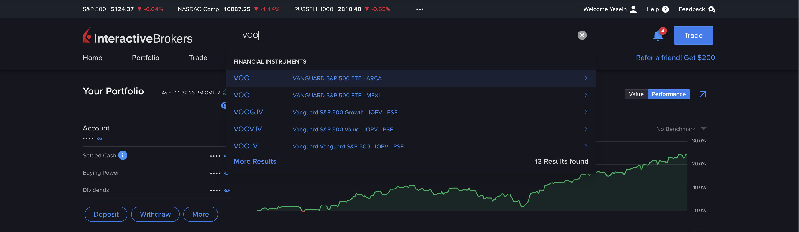

# Empowering Your Finances: A Comprehensive Guide to Money, Taxes, and Living Smart

## License

This project is licensed under the Creative Commons Attribution-ShareAlike 4.0 International License - see the [LICENSE.md](LICENSE.md) file for details.
In Summary, you can do whatever you want with it, just like an MIT license, you just have to give me credits wherever you use it.

> ## ⚠️ Disclaimer:
> 
> Please note that this guide is for informational and educational purposes only and should not be construed as professional financial advice. The content presented reflects personal opinions and experiences and may not apply to all individual circumstances. Financial decisions should be made based on your own due diligence and, where appropriate, with the guidance of a qualified professional.
> 
> The information provided in this guide does not constitute legal, tax, investment, or any other professional advice. The author and contributors are not responsible for any financial loss or other damages that may result from applying the ideas and strategies discussed. Remember that investing in the stock market and other financial ventures carries risks, and past performance is not indicative of future results.
>
> Always consider your financial situation and risk tolerance before making investment decisions and seek advice from financial, tax, and legal professionals tailored to your individual circumstances.

## Table of Contents

0. [Why This Guide Matters Now More Than Ever](#preface-why-this-guide-matters-now-more-than-ever)

1. [Introduction](#1-introduction)
   - My Own Financial Journey
   - The Power and Accessibility of Information in this Digital Age
   - The Power of Money and the Importance of Character

2. [The Reality of Education and the Financial System](#2-the-reality-of-education-and-the-financial-system)
   - Financial illiteracy for most people
   - The Misconception of wealth

3. [Taxes: Understanding and Optimization](#3-taxes)
   - The Necessity of Smart Tax Planning
   - Charitable Acts vs. Government Taxation
   - Case Study: Inefficiency in Government-Managed funds

4. [Legal Strategies for Saving on Taxes](#4-legally-saving-on-taxes-heck-yeah-but-how)
   - Know Your Tax Code
   - Foreign Company in Free Zones
   - The 'Resident of Nowhere' Strategy
   - Dual Residency Benefits
   - Real Estate Depreciation
   - Compliance and Legal Considerations

5. [Frugality: Living Below Your Means](#5-frugality-living-below-your-means)
   - The Philosophy of Frugality
   - Practical Tips for Singles and Families
   - The Impact of a Frugal Lifestyle
   - Global Perspectives on Saving: A Look at China
   - Health and Frugality: A Wealthy Combination

6. [Financial Independence: Saving and Investing](#6-financial-independence-saving-and-investing)
   - Understanding Financial Independence
   - Building the Independence Fund
   - Investment Strategies and Risk Tolerance
   - Stock Market Basics: Stocks, ETFs, and Index Funds
   - Real Estate Investing Strategies
   - Growth vs. Dividends in Investments
   - Debt Management
   - Good Debt vs. Bad Debt
   - Breaking the Physiological Wealth Trap: Defining *'Your Enough'*

7. [U.S. Stock Taxation for Non-Residents](#7-us-stock-taxation-what-you-need-to-know)
   - Capital Gains and Dividends Taxes

8. [Investment Asset Allocation](#8-investment-asset-allocation)
   - Balancing Risk and Reward in Portfolio

9. [Avoiding U.S. Estate Tax for Non-Residents](#9-avoid-us-estate-tax)
   - Utilizing Offshore Companies and Foreign property

10. [Leaving a Legacy vs. Dying with Zero](#10-leave-legacy-or-die-with-zero)
    - The Philosophical and Practical Aspects of Wealth Transfer over future generations.

11. [Beginning Your Investment Journey: A Practical Guide to Stock Market Investing](#11-a-practical-guide-to-stock-market-investing)
    - Step-by-step instructions and key insights for new investors embarking on their journey in the stock market.

## Preface: Why This Guide Matters Now More Than Ever

In the volatile tech industry, where job stability is increasingly rare, financial literacy isn't just valuable – it's essential for survival. In this ever-changing landscape, I want you to adopt a mindset where every day, you're ready to lose your job tomorrow. Such a mindset isn’t about pessimism; it’s about being prepared, adaptable, and resilient in the face of uncertainty.

This guide is born from a pressing need – to empower you, especially if you're part of the tech community, with the knowledge and tools to make informed financial decisions. Consider it your personal handbook for financial resilience; a resource to turn to whenever you find yourself at a crossroads in your financial journey. It encapsulates the lessons, strategies, and insights I've gathered over four years, navigating both prosperous times and economic downturns.

More than just a compilation of financial lessons, this guide is a living, evolving document. It's an invitation to engage, discuss, and enrich its contents. Your insights, questions, and challenges will not only refine this guide but also deepen our collective understanding of financial management.

The essence of this guide goes beyond mere financial accumulation; it's about preparing for the unexpected and turning challenges into opportunities. Job loss, while difficult, can also be a catalyst for growth and new beginnings. Perhaps you didn't enjoy your previous role, or you've been collecting ideas that you've always wanted to explore but never had the time to persue them. Being financially prepared means you can face these transitions with confidence, viewing them not as setbacks but as the perfect chance to start experimenting with those ideas, it may result in a major success.

So whether you're stepping into the tech world, navigating a career change, or somewhere in between, this guide is for you. 

## 1. Introduction

Hey, I'm Yassin Eldeeb. I've gone through the financial roller coaster and come out on the other side. Being in my 20s, following the framework below, I'm standing as a living testament to the principles outlined in this guide.

With no debt whatsoever and an investment portfolio that comfortably supports my family of four members in retirement for the next 40yrs without the need to contribute anything and it can also simultaneously cover my living expenses for an entire decade, this approach to money management shows the power of disciplined saving and investing.

And. Yes, we live in weird times, age is not an indicator of experience, Gen Z and Millennials are more knowledgeable than ever, where just having a curious logical mindset, an internet connection, and time to invest learning. You can consume decades of research of the most valuable resources from the most brilliant people around the world in the matter of weeks and months for free. You can even backtrace their research process and almost be  present in historical moments like the 2008 financial crisis, if you read enough about it, you don't need to go into a crash to learn how to mitigate it, when you know what to expect. So powerful, right?

### The Power of Money and the Importance of Character

Money is one form of power, a tool that can effect, change, and create opportunities for yourself and others. However, with great power comes great responsibility. The information in this guide has the potential to signficantly empower individuals within a short period of time. I hope whoever is consuming this is not a horrible human being. Stay humble, thoughtful, and kind. Just because you feel free or powerful, doesn't mean you have to be an asshole to your employer or your coworkers.

Powerful leaders who have my utmost respect are those who remain humble and down to earth despite their success and power, they tend to also be the most successful. Just because you hold a position of power or possessing wealth does not give you the right to disrespect or undervalue others, whether they are your employees or your peers. True leadership is about inspiring and uplifting everyone in your sphere, recognizing that every individual, regardless of their role or status, contributes value and deserves respect.

### The Misconception of wealth

- **Earning vs. Saving vs. Investing:** Understanding how to make money does not inherently mean understanding how to save or invest it. These are distinct skills with unique knowledge sets. It's not uncommon to see excellent earners who are poor savers, or great savers who struggle to grow their wealth through investment.

- **The Wealth Triangle:** Visualize financial proficiency as a triangle with three points: earning, saving, and investing. Mastery in two of these is essential, but excelling in all three leads to outstanding financial success.

- **Surprising Statistics:** Despite high incomes, many Americans live paycheck to paycheck. A 2022 LendingClub survey revealed that 36% of millionaires live paycheck to paycheck. For individuals earning over $100,000, one out of three experiences this issue, and the number increases to more than one in four for those earning $200,000 or more.

## 2. The Reality of Education and the Financial System

"The formal education system benefits **'the system'** more than the individual. If the economy thrives on consumers spending excessively on 'wants' then there's little incentive to educate people on managing and growing their wealth. Instead, there's a tendency to push consumerism, and leading to financial illiteracy.

In different regions, attitudes towards finance and investment vary significantly. For example, in Europe, there's a reliance on social security; high taxes are paid, but in return, the state handles unemployment, education, and retirement. It's a system that works for many, offering security and simplicity, but from my perspective, it lacks efficiency and personal empowerment.

Contrast this with the US approach, which encourages individual investments through 401K, Roth IRA, and HSA accounts. And when social security systems sucks, it kicks in a sense of personal fear and responsibility in financial matters.

I've spent over 10,000 hours in the past 4 years (which is a rough number indicating developing true expertise in any given skill) learning about personal finance and investing, driven by this need for personal financial security, and I want to share everything I have learned and experienced in this open source guide.

## 3. Taxes

Alright, let's get real about taxes. We're all told that our hard-earned cash goes to fix roads, help the homeless, and all that good stuff. But come on, take a walk around big cities – homelessness, broken roads, and, even drug addicts struggling on the streets. where's all that tax money really going? It's time we face it: the system is messed up and corrupt.

Here's the deal: I'm not saying do not pay taxes you are liable for, that's called "tax evasion" and is very illegal.
But about being smart with taxes, if you're making good money, it's stupid not to look for legal ways to save on taxes, it's not about cheating the system; but playing along, and being smart with your hard-earned money.

> Anyone who earns money and pays taxes has not only the right, but the duty to save taxes.
> 
> Judge Learned Hand in the tax case Helvering v. Gregory

I'm not against giving away, in fact I do highly encourage it. I want you to see and experience the difference yourself between giving up 40% of your income to government and giving away 10% of your income to the people in need in your neighborhood. I'm talking about directly giving away, and not huge charities, I personally don't believe they're helping enough, due to usually having way too much overhead operational costs.

### Charitable Act

Say you're a top 1-5% earner in your country, which are the people that should reduce their tax bills, let's say you earn $100K a year, I want you to see how much $10K have an effect on your neighborhood, and open your eyes on the ineffecient usage of your tax money;

- **Feeding Struggling Families**: With $10K, you can put food on the table to 33 struggling families for a whole month.
- **Cataract Surgery**: The cost of cataract surgery varies, but let’s say it’s around $2,500 per eye without health insurance. Your $10K could fully fund the surgeries for two individuals, completely restoring their vision. This is not just about health; it's about giving someone back their independence and quality of life.
- **Rental Assistance**: Considering an average rent of $1,000 for a modest apartment, your contribution could prevent around 10 families or individuals from being evicted by covering their urgent due rent for a month.
- **Educational Support**: $10K could equip a local underfunded school with new computers or learning materials. For example, if a laptop costs around $500, you could provide 20 laptops, significantly enhancing the learning resources for students.
- **Healthcare Screenings**: If a general health screening costs around $100 per person, your $10K could provide 100 people with essential health checks, potentially identifying health issues early and providing peace of mind.

That is a huge impact from just a single indivudal, that you can see with your own eyes!!

As someone who follows Islam to some extent, there's a number of yearly events where I actively engage in many of the charitable acts I've talked about. But, you surely don't need to be religious to possess a sense of humanity and compassion.

### Case Study: Inefficiency in Government-Managed funds

An alarming example of government financial mismanagement is seen in the case of Egypt’s social insurance funds. Between 2005 and 2013, these funds suffered a shocking 60% loss in the stock market. 60% of your tax money and retirees' income just evaporated!!! Dr. Ahmed El-Borai, the Minister of Social Solidarity at the time, revealed that there was **unspecified portion** of these funds invested in stocks which was in total valued at an astounding 397.7 billion Egyptian pounds, which is about 55.678 billion USD. To put this into perspective, Egypt's GDP was 329.4 billion USD in 2015. Do you see how massive this failure is? No one knows how big or small that portion was.

I'm not a financial expert nor fully understand how my or your government works, and how would they mitigate such a massive failure. But let's take a look at these interesting graphs:

Hmmm...close right? It's also 60%.

You need to understand that, governments aren't these superior infallible entities. A government is made up of people, with authority over a bunch of other people, who have authority over a bunch of other people. And with all the human errors and biases that come with it. People with power over other people, and so on. It's like a chain of human decisions, and not all of them are spot-on.

[Source](https://www.youm7.com/story/2013/12/12/%D8%A7%D9%84%D8%AA%D8%B6%D8%A7%D9%85%D9%86-%D8%A3%D9%85%D9%88%D8%A7%D9%84-%D8%A7%D9%84%D8%AA%D8%A3%D9%85%D9%8A%D9%86%D8%A7%D8%AA-%D9%85%D9%86%D8%B0-2005-%D8%AA%D8%B9%D8%B1%D8%B6%D8%AA-%D9%84%D8%AE%D8%B3%D8%A7%D8%B1%D8%A9-%D9%81%D9%89-%D8%A7%D9%84%D8%A8%D9%88%D8%B1%D8%B5%D8%A9-%D8%A8%D9%86%D8%B3%D8%A8%D8%A960/1394448)

#### The Power of Government Influence and Information Control

When a government faces a financial crisis as massive as Egypt's, it's a situation too enormous to conceal, and hiding it isn't an option. The situation in Egypt is a prime example of how you can’t just sweep a massive financial blunder under the rug. We’re talking about a crash that rattled the entire country – it’s not the kind of thing you can hush up. It hit everyone right where it hurts: hyperinflation kicked in, people saw their savings and income shrink as the value of their currency tanked. These aren't just small hiccups; they’re big, scary tremors that shook up everyone's life.

However, when the mistakes are smaller or the governments are larger and more powerful, the story might be different. These governments can obscure or alter the narrative. They can effectively control information, making it challenging for the public to see the full picture of their financial mismanagement. What's reported might not always tell the entire story. Stay informed, ask questions, and be aware that there's often more to government financial errors than what's initially revealed.

Now we're in 2024, several governments are still using the "recovering from Covid" line as a handy excuse for why we're grappling with inflation, why housing prices are skyrocketing, and why salaries are stagnant. Just so you know, if I remember correctly, COVID-19 lockdown in Egypt only lasted for two months from early April to the end of May 2020, we never really had a long-lasting lockdown as other countries may have had. Everyone got back to work afterwards.

## 4. Legally Saving on Taxes? Heck Yeah! But How?

### The First Step: Your Employment Status

Before we dive into the mechanics of legally saving on taxes, it's crucial to address the foundational aspect of employment status. If you're traditionally employed, with taxes withheld at high rates of 30-40% or even 50%, your options for tax optimization are significantly limited. The room to maneuver and strategically reduce your tax liability begins with having the freedom that comes from not being bound to a typical employment structure. Whether it's through self-employment, contracting, or running your own business, the first step to tax optimization is often stepping outside the traditional employee paradigm. This freedom provides the necessary leeway to employ the various tax-saving strategies we're about to explore.

### Understand Your Tax Code

First off, know the tax laws like the back of your hand or get a professional who does. There are deductions, credits, and allowances that most people don't even know exist. It's not about bending the rules; it's about knowing them well enough to make them work for you. Go to your government taxes website and start reading as much as you can. I can tell you from experience, knowing Egypt and US tax code quite well.

### Legally Saving on Income Taxes

When it comes to income tax, especially if you're in that top tier of earners, there are some savvy strategies that can legally reduce your tax bill. It's not just about deductions and credits; it's about restructuring where and how your income is recognized.

### Setting Up a Foreign Company

One approach is to set up an offshore company, favorably in a free zone. These areas, often found in countries with favorable tax laws like the UAE, which offers significant tax advantages, including 0% corporate tax rate. Other examples in Europe are Hungary (9%), Bulgaria (10%) and Ireland (12.5%) which have low corporate tax rates which can be further reduced with tax write offs and deductions. By structuring your business operations through this foreign entity, you can potentially reduce the overall tax burden close to 0%. However, this is complex and requires careful planning and compliance with all legal requirements, both in the foreign jurisdiction and your home country. Because you might ultimately need to employ yourself through that company and pay yourself a minimum salary or you might hold a "Buisness Owner" status, and receive income from the company in the form of dividends covering just your living expenses.

https://chambers.com/articles/a-complete-guide-for-corporate-taxation-in-uae-free-zone-areas

> For Americans, while the foreign company itself isn’t taxed by the U.S., any ownership stake and income derived must be reported to the IRS, in line with international taxation rules.

### The "Resident of Nowhere" Strategy

For individuals, particularly those who can work remotely and obssessed with travelling, the "Resident of Nowhere" strategy offers a unique way to manage tax liabilities. The idea is to not spend more than 183 days in any single country, thus avoiding becoming a tax resident in most jurisdictions. It involves a nomadic lifestyle, moving between countries while legally minimizing tax obligations. This approach, while not suitable for everyone, especially those with families or fixed job locations, can be effective for digital nomads. But, it's quite complex to set up.

Learn more: https://www.wandererswealth.com/tax-resident-of-nowhere/

> Unfortunately, for Americans, this is not a possible strategy, as you are taxed on your worldwide income regardless of where you live, due to U.S. tax policies.

### Tax Benefits of Dual Residency

If you're up on exploring a new country, another approach is to establish residency in a country with favorable tax laws while maintaining your citizenship in your home country. Some countries offer special tax statuses to new residents, which can significantly lower your tax burden. This requires balancing the rules of both countries and might involve spending a certain amount of time in each country.

> American should be aware that while they can claim an exemption on foreign earned income up to a certain threshold (approximately $120K), they are still subject to U.S. taxation on worldwide income above this limit.

### Real Estate Depreciation

Real estate depreciation is a globally utilized tax strategy, essential for property investors. It involves allocating the cost of purchasing and improving a property over its useful life, thereby decreasing taxable income. This method is particularly influential in the United States, where residential properties are typically depreciated over 27.5 years and commercial properties over 39 years.

And with depreciation, investors can benefit from various tax deductions. These include mortgage interest, which forms a significant part of property loan payments and can be deducted from taxes. Operating expenses related to the property, such as repairs, management fees, utilities, and insurance, are also often tax-deductible. Property taxes paid on the property provide another deduction opportunity.

The strategy also considers the cost of improvements and repairs. Major improvements, while not immediately deductible, contribute to the property's basis and enhance annual depreciation claims. Repairs may be immediately deductible, depending on their nature.

### Caution and compliance

It’s crucial to note that while these strategies can offer tax savings, they also come with complexities and legal considerations. Tax laws vary widely by country and change frequently. It's not just about finding loopholes; it's about understanding the legal framework and ensuring full compliance.

## 5. Frugality: Living Below Your Means

A common principle many wealthy people follow is: "Always live as if you're poor".

In addition to examining how to optimize your tax setup, another key principle I advocate for is living below your means, regardless of your income. Whether you're earning $10,000, $40,000 or $200,000 annually, the concept of avoiding lifestyle inflation is crucial. It's tempting to increase your spending as your income grows, but resisting this urge can lead to greater financial freedom and security. Also, note that downgrading your lifestyle is much more difficult than upgrading it.

Consider this: aim to live on a basic budget as an individual, covering essentials like a modest living space and home-cooked meals. This approach isn't just about saving money; it's about prioritizing your health and wellbeing over material possessions. Remember, buying things often provides only temporary happiness. True, lasting contentment often comes from the freedom to pursue hobbies, spend time with family, and work on passion projects.

And let's talk about the common saying, *'Money doesn't buy happiness.'* While there's some truth to this, people that say this likely have never been in poverty, financial stress and insecurity can significantly hinder happiness. The peace of mind that comes from having a financial cushion cannot be underestimated.

> "Money won't solve your problems...WHAT A CROCK OF SHIT??!"
>
> Casey Neistat

Casey Neistat hit the nail on the head with his take on this.

---------

Hypothetically, imagine earning $100,000 a year, having your taxes at a low 0-10% rate and living on just $1,000 per month. This strategy means that for every month you work, you're saving enough to sustain yourself for almost seven months. Over a couple of years, this could equate to nearly 14 years' worth of living expenses, do you understand how a big of a deal that is?? Such savings can be life-changing, offering the freedom to start your own venture or take a break from work whenever you'd like.

For those who have a spouse and kids, when it comes to parenting and lifestyle, it's important to set realistic expectations for your children. Providing them with a comfortable life is essential, but it's also beneficial to teach them the value of money and the importance of living within means. Setting up an extravagant lifestyle as the norm can create unrealistic standards for happiness and success for your child. Instead, focus on instilling values of gratitude, simplicity, and the joy of experiences over material possessions.

In summary, the way you manage your personal finances, including how you respond to potential tax savings, can have a profound impact on your quality of life. It's not just about accumulating wealth, but about creating a lifestyle that prioritizes freedom, happiness, and financial security.

### Global Perspectives on Saving: A Look at China

In contrasting global savings behaviors, a stark difference emerges between Eastern and Western cultures. For example, as of December 2021, the gross savings rate in China is about 45.9%. This means for every $100 earned, approximately $46 is saved. This high savings rate is deeply rooted in Chinese culture, emphasizing the importance of financial security and independence, and that's the average savings rate, it's likely that higher-income earners in China save much more than this average. In contrast, in the United States, where consumerism is more prevalent, the savings rate hovers between 3.5% to 5%.

This lower rate reflects a cultural emphasis on consumption, a trend notably reinforced post-World War II. An emblematic quote from this era captures the essence of this consumption-driven approach:

> "We must also work together to achieve important goals for the American people here at home. This work begins with keeping our economy growing, and I encourage you all to go shopping more."
>
> George W. Bush / [Source](https://www.youtube.com/watch?v=fxk9PW83VCY&ab_channel=oyvey)

I highly encourage watching "The Chinese Secret to Saving Money Revealed" video on youtube.

https://www.youtube.com/watch?v=ms1nTeFO7ps&ab_channel=HumphreyYang

#### Health and Frugality: A Wealthy Combination

While we've discussed the financial benefits of a frugal lifestyle, it's also crucial to address another aspect of frugality that often goes overlooked: health. Yes, living frugally isn't just about saving pennies; it's also about investing in your well-being.

##### The Health-Wealth connection

It's no secret that your health has a direct impact on your wealth. Medical bills are among the leading causes of financial hardship. So, when we talk about frugality, it's not merely about cutting down your spending; it's also about eliminating habits that cost you both in terms of money and health.

##### Cutting the Junk

Take a hard look at your expenses and identify what might be sapping both your finances and your vitality. The usual suspects? Junk food, cigarettes, vaping, alcohol, and any form of recreational drugs. These not only eat away at your wallet over time but also come with a hefty price tag for your health.

**Junk Food: The Slow Drain**

Opt for home-cooked meals over fast food. Not only is it cheaper, but it also allows you to control what goes into your food, favoring nutrients over empty calories. The occasional cheat meals are fine, but making it a habit can lead to both financial and health issues down the line.

**Smoking and Vaping: Burning Money and Health**

If you smoke or vape, you're not just burning through packs; you're also burning through cash. And let's not even get started on the long-term health implications. Cutting out smoking or vaping can lead to significant monthly savings and greatly reduce your risk for a multitude of health complications.

**Alcohol: The Costly Spirit**

Moderation is key. Occasional social drinks might not break the bank, but frequent drinking sessions can. Besides, the health risks associated with alcohol abuse can lead to substantial future medical expenses, far outweighing any immediate pleasure.

**Recreational Drugs: A High Price**

While it might seem obvious, it's worth mentioning that recreational drugs are both illegal and costly. They can drain your finances, compromise your health, and have legal repercussions that could devastate your wealth and future.

##### Invest in Your Health

A frugal lifestyle is not about deprivation; it's about prioritizing and making smart choices. By investing the money you save from cutting out unhealthy habits into your health—through gym memberships, wholesome foods, or even health supplements -- you're not just saving money, you're enriching your quality of life.

Remember, being wealthy isn't just about the balance in your bank account; it's also about having the health to enjoy what you've worked so hard to accumulate. As the saying goes, "Health is wealth", and in the grand scheme of frugality, **the healthiest choice is often the most economical one.**

### Rent is very expensive where I live, there's no way I can save this much

Living frugally in high-cost countries like Australia, the US, or Israel is undoubtedly more challenging to live on a smaller budget, but with strategic planning and a focus on what truly brings happiness to you or your family, it's achievable. It's about finding a balance that works for your unique situation.

#### For Singles:

For those who are single and have the flexibility, you could move with your friends as roommates which significantly reduces your monthly rent, also for those of you who are in early 20s and still with good relationships with their families, come on...you really don't need to move out of your parents house, you can save so much in rent.

Another option could be to adopt a nomadic lifestyle as discussed in the 'Resident of Nowhere' section, and travel to countries in Asia, Eastern Europe, South America or Africa, where living expenses are often lower, can allow you to maintain a lifestyle within that theoretical $1,000 per month. Plus, you'd still have up to 183 days per year to spend in your home country, balancing exploration with maintaining connections with family and friends.

#### For Families:

For those with a spouse and children, this nomadic approach might not be feasible, especially considering the importance of stability and education for kids. In this case, the focus should shift to optimizing expenses within your home country. This could include:

1. **Housing**: Look for affordable housing options, possibly outside of major city centers. This might mean smaller accommodations or considering suburban areas where the cost of living is typically lower.

2. **Education**: Instead of private schooling, which can be expensive, explore public or community schools. Many countries offer high-quality public education.

3. **Lifestyle**: Emphasize quality family activities that are low-cost or free. Parks, hiking, and community events can offer enriching experiences without the hefty price tag.

4. **Groceries and Meals**: Cooking at home and smart grocery shopping can significantly reduce monthly expenses. Buying in bulk, choosing local and seasonal produce, and minimizing waste are key strategies.

5. **Transportation**: Using public transport, carpooling, or biking can be more economical than maintaining a private vehicle, especially in urban areas.

6. **Secondary Income Streams**: Consider side hustles or remote work opportunities that can supplement your income without requiring a significant lifestyle change.

Raising children can involve significant financial commitments, but they are often a deeply rewarding investment.

### The Bigger Picture and Impact Of Such Strategy

All what we have discussed on savings and investing is all about crafting a lifestyle that's rich in freedom, happiness, and security. I read a quote from Mark Zuckerberg from 2017 that hit me really hard: “The greatest successes come from having the freedom to fail” and he's spot on, having financial security which gives you the space to take risks that most can't take, to try a new venture, fail a tens or hundreds of times, and ultimately find your success. A successful person is just a person who failed enough to find success.

https://www.cnbc.com/2017/05/25/mark-zuckerberg-on-success-billionaires-should-pay-you-fail.html

### 6. Financial Independence: Saving and Investing

Now, we're diving into the really fun part! You're earning well and living smart (not blowing cash on every shiny thing). So what do you get? A big, fat pile of savings. But what's next? How do you use that to really change your life? That's where financial independence comes in.

#### So, What Is Financial Independence?

Financial independence also called "FIRE" (Financial Independence, Retire Early) means you've got enough bucks saved and invested to cover your life and expenses without the need of a full-time job. Sounds dreamy, right? It's about having the freedom to choose – whether you want to keep working, switch careers, start a business, or just kick back and relax. It's not just about being 'rich'; it's about having control over your time and choices.

As a general rule, you should be saving enough to cover yearly expenses multiplied by 25, enabling a safe withdrawal rate of 4% per year for a 30 year retirment period. This strategy is designed to sustain financial stability throughout retirement without depleting the principal amount.

Learn more: https://www.cnbc.com/select/what-is-the-4-percent-retirement-savings-rule/

This is just a general rule, you don't really need to exactly follow it, even the inventor of this rule said himself that 4% might be outdated and needs to be adjusted for 4.5% (https://finance.yahoo.com/news/even-inventor-bill-bengen-revisiting-143000007.html). But if you're retiring in your 20s or 30s, you should aim for an even lower withdrawal rate for example: 3% since your portofolio is expected to last 3x the timeframe of a regular retiree.

If you want a more comprehensive answer, I'd encourage you to watch "How Much $ Do You Need to Retire? The 4% Rule for 2023" youtube video:

https://www.youtube.com/watch?v=RUNzB_Nd3wc&ab_channel=HumphreyYang

You can use this calculator to input your savings rate to know how far you are from your FIRE goal. This calculator illustrates how powerful your savings rate contributes to your speed of reaching financial independence.

https://networthify.com/calculator/earlyretirement

Consider the difference between someone in Germany, who lives very frugally and optimizes his taxes. He can be financially free only within 5.6 years.

On the other hand, if you take the national average savings rate in Germany of 12%, all of a sudden, now your goal is 47.5 years away.

Another very cool tool I have found is this Monte-Carlo-Simulation, I can't express how much I love this tool, this puts your parameters into a series of simulated scenarios based on the available historical data.
https://www.portfoliovisualizer.com/monte-carlo-simulation

Keep in mind, retiring in the traditional sense is **"EXTREMELY BORING"**.

> Never stop working
>
> It's a trap
>
> Pieter Levels @ https://twitter.com/levelsio/status/1764137099576369235

Especially if you're doing it early, what I mean by FIRE is financial independence and the freedom of pursuing your own thing without worrying about living expenses that are covered by your employer. You can start a company, build a product, without the need of VC (Venture Capitalist), and have full ownership over what you're building, without the financial stress, that many founders are experiencing.

#### Building the Independence Fund

The key to financial independence is building what I call an 'Independence Fund.' This is your war chest, your ticket to freedom. It’s not just saving money in a bank account; it’s smartly investing it so it grows and works for you.

#### Risk Tolerance: Know Yours

Before you dive into investing, get real with yourself about your risk tolerance. This is all about how much uncertainty you can handle with your investments. Some people can watch their investments drop by 20% and not bat an eye, while others might lose sleep over a 5% dip. Figure out where you stand, because it will derive your investment assets.

Risk tolerance affects how you should invest. More risk usually means a shot at higher returns, but it also means more ups and downs. Less risk generally offers more stability, but the growth might be slower.

#### Investing: Make Your Money Grow

Here’s where it gets real exciting. Investing your savings isn’t just about stashing away cash; it's about making your money grow exponentially over time. Here's the lowdown:

- **Stock Market**: Stocks can be volatile, but over time, they’ve historically provided solid returns. We're talking long-term here. Think of buying shares in companies as owning a piece of those businesses.

- **ETFs and Index Funds**: These are like the chill-pill of the stock market. Instead of picking individual stocks, you invest in a bunch of them at once. This spreads out your risk and gives you a slice of the broader market's growth.

- **Retirement Accounts**: If you’ve got access to things like a 401(k) or a Roth IRA, max them out. They offer tax advantages on your capital gains.
  - **Note on Accessibility:** Keep in mind that these accounts are designed for long-term retirement savings. Funds in a 401(k) or Roth IRA are generally not accessible without penalty until you reach retirement age (usually 59½ years old). Early withdrawals can incur penalties and taxes, diminishing the benefits of these accounts.

- **Real Estate**: Owning property can be a smart move, but it’s not a sure-fire win. It's about picking the right property in the right place at the right time. And remember, it's not just buying; it's managing the property, dealing with tenants, repairs... the whole shebang, it's not as passive as the stock market.

- **Diversification**: Don’t put all your eggs in one basket. Spread your investments across different types – stocks, bonds, real estate, maybe some crypto if you're feeling adventurous. Diversification helps smooth out the bumps along the way.

- **Bonds**: Bonds are a crucial part of a diversified investment portfolio. They offer a more stable, typically lower, return compared to stocks. Bonds can act as a buffer against the volatility of the stock market, providing regular income and reducing overall investment risk.

- **Emergency Fund**: An emergency fund is essential for financial stability. Aim to save an amount equivalent to 3-6 months of your monthly expenses. This fund serves as a buffer against unexpected financial challenges, such as job loss, medical emergencies, to avoid selling some of your investment portofolio at an unfavourable time.

Stay informed, keep learning, and be ready to adapt. The financial world changes, and so should your strategies. Don’t just set it and forget it. Keep an eye on your investments, and adjust as needed.

Investing is a marathon, not a sprint. It’s about making regular contributions, letting compound interest work its magic, and not freaking out when the market does its rollercoaster thing.

#### Understanding Stock Picking, ETFs, and Index Funds

Let's talk about the basics of stock market investing. There are a few different ways to play the game: stock picking, ETFs (Exchange-Traded Funds), and index funds. Understanding these can help you make more informed decisions about where to put your money.

#### Stock Picking: High Risk, High Reward?

Stock picking is like going to a huge market and choosing exactly what you want to buy. You do your research, pick individual companies you believe will perform well, and buy their stocks. It's kind of thrilling, but here's the catch: it's risky, very very risky. You're betting on specific companies, which means if they do great, you could see some sweet returns. But if they don't, well, your investment might go down potentially to zero.

#### ETFs: The Diversified Approach

Now, onto ETFs. Think of an ETF as a basket of various stocks or bonds. These baskets usually track an index, sector, commodity, or other asset, but you can buy or sell them just like a regular stock on a stock exchange. The cool part? You get diversification, which is super important in investing. It spreads your risk because you're not just tied to the fate of one company.

#### Index Funds: The Smart Passive Investment

Index funds are a savvy choice for those who prefer a "ride-along" approach to investing. Similar to ETFs, they are mutual funds designed to track and match the performance of a specific market index, such as the S&P 500. The goal with index funds isn't to outperform the market but to emulate its composite performance.

The beauty of index funds lies in their simplicity and efficiency. They operate under a passive management strategy, meaning there's less frequent buying and selling involved compared to actively managed funds. This passive nature typically results in lower expense ratios (i.e., the fees you pay to own the fund), making index funds a cost-effective option for investors.

#### What is a Stock Market?

Imagine a giant marketplace, but instead of buying and selling physical assets, people are trading shares of companies. That's the stock market for you. It's a hub where businesses list their shares, and investors buy these shares, hoping the company grows and their investment with it. The stock market is the heartbeat of the financial world, indicating the health of economies and sectors.

#### The S&P 500: A Market Snapshot

Think of the S&P 500 as the stock market's all-star team. It's a lineup of the 500 biggest companies in the U.S., all packed into one index. Investing in the S&P 500 is like getting a piece of the top 500 performers in the U.S. economy But here's the kicker: the S&P 500 itself isn't something you can just go out and buy. It's like a scoreboard showing how these top companies are doing. To get in on the action, you dive into index funds that track the S&P 500. These funds mimic the index's performance, so when the S&P 500 does well, so does your investment in these funds. It's a way to ride the waves of the U.S. economy's biggest players.

Historically, it has returned on average 10% per year, there's years of ups and years of downs, but ultimately on the long-term, it averages a positive return.

#### Investor Protection

When it comes to stock investing, security is very crutial. The Securities Investor Protection Corporation (SIPC) protects stock investments up to $500,000 per institution, including a $250,000 limit for cash in a brokerage account. This safeguard ensures that your investments are protected, adding an extra layer of confidence in your financial strategy. So when your brokerage fails, your assets are still protected by the U.S. government.

#### Compound Interest: The Growth Multiplier

Compound interst is like a snowball rolling down a hill. You start with a certain amount (the snowball), and as it rolls (over time), it picks up more snow (interest). Not just that, it’s interest on your interest. For example, if you start with $1,000 and it grows at 10% annually, you don’t just earn on the original grand. Each year, the interest is calculated on the growing amount, turning your initial sum into a much larger figure over time.

Compound interest is why investing early and consistently is a game-changer.

That's because the initial phase of growing your investment can be slow. But once you cross certain thresholds, like that first $100K, compound interest starts flexing its muscles, and your investment begins to grow at a faster rate. Imagine a year like 2023 where the S&P 500 made a total of 26% yearly return, that is $26K on your $100K. Plus, if you were consistently investing throughout that year, each addition benefits from this growth, further accelerating your progress. Effectively, reaching your next $100K becomes significantly easier.

You can also use this calculator:
https://www.investor.gov/financial-tools-calculators/calculators/compound-interest-calculator

#### Real Estate Investing: A Closer Look

Real estate investing isn't just about buying your dream home; it can be a strategic move for financial growth, especially if approached creatively and with an understanding of the risks and rewards involved.

#### House Hacking: Living for Free (or Almost Free)

In some countries, a clever strategy called 'house hacking' can turn real estate into a double win. This involves purchasing a multi-family property, living in one unit, and renting out the others. If done right, the rent you collect can cover your mortgage and expenses, essentially allowing you to live rent-free. Another variation is buying a house or apartment suitable for Airbnb or long-term rentals, where your tenants' payments can cover or contribute significantly to your mortgage.

#### The Math of Leverage in Real Estate

One aspect that makes real estate intriguing is the power of leverage. Let’s say you're comparing a typical real estate return of 5% annually to the stock market's average of 10%. The key difference is leverage. With real estate, you're often only putting down a portion of the property’s value (like 20%) as a down payment. So a 5% growth on the entire property value is effectively a much higher return on your initial investment. For example, a 5% increase on a property with only a 20% down payment essentially means a 25% return on your initial investment, due to the leverage effect.

#### Renting vs. Buying: A Critical Decision

A common financial pitfall is the 'need' to buy a house. While owning a property is traditionally seen as a significant achievement, it's not always the best financial move. Renting offers flexibility and freedom from the responsibilities and costs of homeownership, such as mortgage, maintenance, taxes, and insurance. Plus, if your stocks investments are yielding higher returns than the cost of renting compared to buying, it might make more sense to keep renting.

Before deciding, consider using tools like the [Rent vs. Buy Calculator](https://smartmoneytools.co.uk/tools/rent-vs-buy/). This can help you crunch the numbers on the long-term costs and benefits in your specific situation.

#### The Power of Investment Choices: Real Estate and Stocks

- **Real Estate:** Buying a house in cash might seem prudent, but it's not always the best investment strategy. Paying cash avoids interest on a loan and reduces closing costs, but it also forgoes the potential for that cash to earn more if invested elsewhere.

- **Leveraging a Mortgage:** With interest rates typically lower than average stock market returns, a mortgage can be a form of 'good debt.' Investing the cash you would have used to buy a house can yield higher returns, making mortgages advantageous for those with good credit score.

- **Tax Benefits:** Mortgage payments often qualify for tax deductions, potentially offering more savings than the cost of interest on that mortgage.

#### Understanding the Risks: Mortgage and Property Seizure

Like any investment, real estate comes with its risks and rewards. On the one hand, it can provide a steady income stream, potential tax benefits, and capital appreciation. On the other, it requires significant upfront capital, ongoing maintenance costs, and the potential for market fluctuations and vacancy periods. Real estate is not a liquid asset, meaning it can't be quickly converted to cash without potentially impacting its value.

An essential risk to consider in real estate investing is the commitment to a mortgage. If you're unable to keep up with mortgage payments due to financial challenges, market downturns, or unexpected life events, you could face serious consequences. The most severe of these is the possibility of the bank seizing and reselling your property to recover the unpaid loan amount. This risk underscores the importance of having a solid financial plan and emergency funds in place before diving into real estate investment, especially strategies like house hacking. Ensuring that your investment is within your means and having a backup plan in case of rental vacancies or other income disruptions are critical steps in safeguarding your financial stability in the realm of real estate.

### Growth vs. Dividends: A Strategic Investment Choice

Investment assets often fall into one of two categories: growth stocks and dividend stocks. Understanding the difference between these can be crucial for your investment strategy.

#### Growth Stocks: The Long-Term Game

- **What Are They?** Growth stocks are shares in companies that reinvest their earnings into expanding the business, developing new products, or other growth activities. These companies might not pay dividends, but they offer the potential for substantial capital appreciation.
- **Risk and Reward:** While growth stocks can offer higher returns, they also come with increased risk. Their value is tied closely to the company's future potential, which can be uncertain.
- **Ideal For:** Investors looking for long-term capital appreciation and willing to withstand market volatility.
- **Examples:** Apple, Nvidia, and Google.

#### Dividend Stocks: The Income Generators

- **What Are They?** Dividend stocks belong to established companies that pay out a portion of their profits to shareholders, typically in the form of dividends.
- **Steady Income:** These stocks offer regular income, which can be especially appealing to retirees or those looking for a steady cash flow.
- **Lower Risk, But...:** While dividend stocks tend to be less volatile than growth stocks, they tend to offer lower long-term capital appreciation.
- **Examples:** McDonald's, Coca-Cola, Walmart, and JPMorgan.

### ⚠️ Debt Management

Before embarking on investment strategies, focus on eliminating any outstanding "bad" debts. Methods like the debt snowball or avalanche are effective strategies for tackling debts systematically. Start by either paying off the smallest debts first for motivational wins (snowball) or targeting the debts with the highest interest rates (avalanche).

### Good Debt vs. Bad Debt

- **Definition:** 'Good' debt can increase your net worth or significantly enhance your life. On the other hand, 'bad' debt is tied to depreciating assets or consumption.

- **Examples:** Mortgages with favorable interest rates and investment in educational materials are examples of good debt, whereas high-interest credit card debt for consumer goods represents bad debt.

Understanding the difference between these two types of debt is crucial in creating a healthy financial plan. While it's essential to get rid of bad debt as soon as possible, good debt can be a strategic part of your financial growth and should be managed wisely.

### Breaking the Physiological Wealth Trap: Defining *'Your Enough'*

Achieving early financial freedom isn’t just about how much wealth you accumulate but also in recognizing what constitutes **‘enough’** for you. Understanding when your financial achievements align with your life’s ambitions is crucial. This insight allows you to savor the freedom afforded by your finances, rather than persist in an endless pursuit of more, without pausing to enjoy what you've already achieved.

Here's a clear perspective:

- Often, people set a financial target like reaching a net worth of $1 million, believing it will bring ultimate satisfaction. However, upon reaching that milestone, they shift their goal to $5 million, then $10 million, continually pushing happiness into the future.
- Shifting focus from a monetary target to what genuinely fulfills you, such as being able to cover living expenses, engage in hobbies, or travel, can redefine your concept of success. This is not about the total in your bank account, but how it supports the life you want to lead.
- Many people tend to overestimate their needs in a free or retired lifestyle. They might imagine a complete transformation in their daily activities or expenses, but in reality, desires and routines often remain more constant than anticipated. Understanding this can help in setting more realistic financial goals and recognizing when you've reached a satisfactory level of financial freedom.

### 7. U.S. Stock Taxation: What You Need to Know

Owning U.S. stocks as a non-US-resident can have tax implications. Here are key points to consider:

##### Capital Gains tax (Growth)

- **For Non-U.S. Residents:** If you're not a U.S. resident, you're generally not subject to U.S. capital gains tax on U.S. stocks.
- **Reporting Requirements:** However, you may have reporting requirements in your home country, so it's important to understand those rules.

##### Dividends Tax

- **Withholding Tax:** The U.S. typically withholds 30% tax on dividends paid to non-US-resident investors.
- **Tax Treaties:** The U.S. has tax treaties with many countries that may reduce this withholding rate, so check the treaty between the U.S. and your country. You need to file a W8-BEN Form to claim that tax treaty benefits which can reduce your taxes from 30% down to 15%.

### 8. Investment Asset Allocation

Diversifying your investment portfolio is key to balancing risk and reward. A 100% stock portfolio may suit those seeking higher returns and willing to tolerate greater risk. In contrast, a mix of 60% stocks and 40% bonds might be more appropriate for someone seeking stability, especially in retirement.

There's no specific rules really, you just create your own; experiment, observe, adjust.

### 9. Avoid U.S. Estate Tax

Non US Residents (foreigners) are liable for U.S. estate tax on U.S. Stocks that they own, U.S. Stocks are considered U.S. property for U.S. estate tax purposes. Even if they're owned by a foreigner, the fair market value of those stocks at the time of death are going to be subject to U.S. estate tax at rates of up to 40% !!!!

This is a very dirty sort of a hidden tax, most people don't know about.

So you could be a Spanish citizen, never have been to the United States, but owning U.S. stocks, and if you die owning those stocks, you're liable for U.S. estate tax up to 40%.

Almost 40% of all U.S. publicly listed companies are owned by foreigners, almost every single portofolio whether it's self managed or professionally managed contains U.S. stocks, so this is a huge issue that most people are unware of.

Imagine dying with a portofolio of $1.5M, leaving your children with $924K, which is a lot less than what should they have inherited.

#### Solution?

Setup a [RakICC company](https://www.rakicc.com/) which is a free zone company in the UAE with zero capital gains taxes.
Which is gonna be a Non-US Corporation, and put your entire portofolio under the assets owned by that RakICC company, so the RakICC company owns all of your stock portofolio, the only thing you own are the shares to that RakICC company, and becuase that RakICC company is not a U.S. company, its shares are not considered U.S. property, they become foregin property, and they're not subject to U.S. estate tax. Think of it as this, you die, your children inherit the shares of your company, the company can't die, and it's foregin proeprty. The transfers of those shares due to the favorable tax nature of the UAE will be tax-free.

Highly recommend watching this video for full details:

https://www.youtube.com/watch?v=n1oOaWqscks&ab_channel=EsquireGroup

### 10. Leave Legacy or die with zero?

The decision between leaving a financial legacy and the philosophy of 'dying with zero' presents a significant dilemma in financial planning. This choice reflects not just financial strategy but also deeply personal values and beliefs about wealth and its purpose.

#### The Case for Leaving a Legacy

Traditionally, accumulating wealth to leave a substantial inheritance has been seen as a noble objective. This approach often stems from a desire to provide for future generations, giving them a financial headstart. However, the reality of inheritance management can be complex. Statistics indicate that inheritances often don't last as long as one might expect:

- A study by the Williams Group wealth consultancy found that 70% of wealthy families lose their wealth by the second generation, and a staggering 90% by the third generation.
- The reasons for this rapid depletion include financial mismanagement, lack of preparedness to handle wealth, and family disputes.

These statistics highlight the challenges and responsibilities that come with managing and preserving wealth across generations.

##### The 'Die with Zero' Philosophy

Contrasting with the legacy approach is the 'die with zero' philosophy, which advocates for using one's wealth during their lifetime to maximize life experiences and personal fulfillment. This mindset is grounded in the understanding that life is finite, and wealth is a tool for living fully rather than merely an end in itself.

- According to Bill Perkins, author of "Die with Zero" book, the goal is to optimize lifetime experiences rather than maximize wealth transfer.
- The philosophy encourages strategic spending on travel, education, health, experiences, and even gifting before death to enjoy the benefits with loved ones.

The 'die with zero' approach also addresses the reality that many inheritances are squandered or do not contribute significantly to the beneficiaries' long-term financial stability.

In conclusion, it's ultimately, your personal decision on which philosophy you might want to persue.

### 11. A Practical Guide to Stock Market Investing

Now, let's get our hands dirty. How do you get in to that wonderful portal of the stock market? Through a brokerage account.

A brokerage account is an bank account under the brokerage firm, that allows you to deposit cash, and invest it in the stock market. A brokerage offers a ton of features from yearly yield graphs, projected income, retirement planning tools, tax with-holding on your behalf in the case of dividends, security features, and much more.

We will use Interactive Brokers in this guide, as it's one of the most biggest, safest, modern, and long running brokerages in the market.

You can use my referral link to sign up for a new account https://ibkr.com/referral/yassin953 where I get $200 and you get up to $1000 in stocks for free.

After following all of the sign up procedures, and waiting on your account to be activated. Login into your account portal, and you're gonna be presented with this Dashboard UI. You won't have any numbers or a graph of your performance, because you don't have any data yet.

First things first. Enable dark mode.

Navigate to the transfer funds section.

And start the process of depositing cash into your brokerage account, so you can investing!

Choose your deposit method, and get the instructions to follow. Each method differs in speed, fees, etc...

Once, you deposit cash into your account successfuly, now you can start investing!

Use the search bar at the top to look for the "Ticker" of your stock, ETF, index fund or bond. A Ticker is just a unique name to identify an market asset.

I will go ahead and type "VOO", which is one of the most popular and diversified stock in the US market tracking the performance of the S&P 500, which covers the total 500 biggest companies in the US. It's also very cheap, with only a 0.03% expense ratio (the fees you pay to own the fund).

VOO is a growth focused index fund, but also pays out 1.34% in annual dividends.

Learn more about the stock here:
https://investor.vanguard.com/investment-products/etfs/profile/voo

Click the "Buy" button on the VOO page, and enter the quantity, it can be the number of shares or the amount in USD you would like to pay. IBKR also supports fractional shares, which means if VOO is trading at 460, you don't need 460 to buy it, you can buy a fraction of the stock, say $1 of VOO.

#### When to buy? Is now a good time to buy?

For term long-term, it doesn't matter when you purchase, you don't need to time the market. A common strategy known as "dollar-cost averaging" encourages you to setup a recurring order to automatically invest periodically, so you can get a good average price. Studies shows dollar cost averaging tend to outperform timing the market and lump sum.

https://www.schwab.com/learn/story/what-is-dollar-cost-averaging

### **Congrats! You're now a proud owner of tiny parts of the biggest 500 countries in the US. 🎉**
